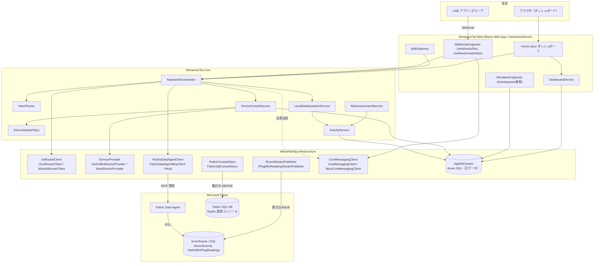

# CareRoute AI ／ 見守り隊

> 離れて暮らす家族のための、安全第一の高齢者見守りサービス
> *An elderly-watch ("見守り") assistant for families who live apart — hackathon project.*

🏛️ **都知事杯オープンデータ・ハッカソン2026 応募作品**です。環境省の暑さ指数（WBGT）と気象庁アメダスのオープンデータを家電の消費電力と突き合わせ、熱中症・ヒートショックを先回りで防ぎます。利用したオープンデータの一覧とライセンスは [docs/OPENDATA.md](docs/OPENDATA.md) にあります。

> 本作は [AI HACK 2026](https://aihackathon.jp/) の提出作品から発展させたものです。AI HACK 2026 への提出時点のコードは別リポジトリ [monoqlo78/mimamoritai-careroute-ai](https://github.com/monoqlo78/mimamoritai-careroute-ai)（tag `aihack-2026-submission`）に凍結してあります。

📝 開発記録（Qiita）: [離れて暮らす高齢の家族を見守るサービスを作った ― 本人は「エアコンつけて」、家族は LINE で様子がわかる（Azure + Microsoft Fabric + OrcaRouter）](https://qiita.com/monoqlo78/items/27ea5bfa760bd8e3c3b7) — 同じ内容はリポジトリ内の [docs/ARTICLE.md](docs/ARTICLE.md) にもあります。

🎬 デモ動画（3分11秒・字幕＋ナレーション入り・本番環境の画面録画）: https://youtu.be/TnM-RHFZ_Lc — 原本は [docs/demo/mimamoritai-demo.mp4](docs/demo/mimamoritai-demo.mp4)、収録内容の一覧は [docs/demo/README.md](docs/demo/README.md) にあります。

---

**まず、動いているところから。**


家じゅうのデバイスから届いたイベントが、Azure SQL と Microsoft Fabric へ流れていく様子です。WebGL で描画していて、**映っている数字はダミーではなく、その時点の実データ**です。下段の「同期ジョブ 停止中」も演出ではなく、本当に止まっている状態を表示しています。


ダッシュボードに常駐する3Dマスコットの「ミマモ」です。**話しかけると反応します**。既製の素材ではなく、Blender MCP と自作の MCP サーバー [WindowsComputerUseMCP](https://github.com/monoqlo78/WindowsComputerUseMCP)（「作る」はスクリプト、「見えているか」は画面キャプチャ）を組み合わせてモデリングし、glTF として書き出したものです。

---

## これは何か・解決したい課題

一人暮らしの高齢の家族を持つ人にとって、「今日は元気にしているだろうか」を毎日確認するのは負担です。一方で、カメラなどによる常時監視はプライバシーの観点で受け入れ難いことが多くあります。

**CareRoute AI / 見守り隊** は、家庭内のスマート家電（照明・扇風機など）の ON/OFF イベントから生活リズム（起床・就寝・深夜の活動など）を推定し、

- 家族が LINE や自然言語で「今日のお母さんどう？」と聞けば答え、
- 家電のリモート操作もチャットからできるが、
- **AIには絶対にすべてを任せない** — 安全な家電のみ、確信度が高い時だけ、しかも操作ログは成功・失敗・拒否のすべてを監査記録する

という設計を採っています。デバイス連携（SwitchBot）・AIルーティング（OrcaRouter）・データ分析（Microsoft Fabric Data Agent）・家族連絡（LINE）はすべて実連携とモックを切り替え可能で、**秘密情報が一切無くても `dotnet run` だけでフル機能のデモが動きます**。

## アーキテクチャ概要



### データの流れ ― どこが何を読んでいるか

**正データ（source of truth）は Azure SQL だけです。** Fabric は「分析のための写し」であり、画面表示・家電操作・アラート判定が Fabric に依存することはありません。Fabric が止まってもアプリの機能は落ちません。

| 経路 | 向き | 実装 | 用途 |
| --- | --- | --- | --- |
| アプリ → Azure SQL | 読み書き | `AppDbContext`（EF Core） | **すべての画面・LINE 応答・家電操作・監査ログ**。ここだけが正データ |
| アプリ → Eventhouse `DeviceEvents` | **書き込みのみ** | `EventhouseStreamPublisher` | 家電の ON/OFF イベントを時系列分析用に複製 |
| アプリ → Eventhouse `SwitchBotPlugReadings` | **書き込みのみ** | `EventhousePlugMiniReadingStreamPublisher` | Plug Mini の電力テレメトリを**ポーリング周期ごとに**複製（状態変化が無くても） |
| アプリ → Fabric Data Agent → Eventhouse | 質問 → 自然文の回答 | `FabricDataAgentMcpClient`（MCP） | **複数日にまたがる傾向・比較の質問だけ**。Data Agent が KQL を書いて Eventhouse に問い合わせる |
| アプリ → Fabric SQL DB | 書き込み（MERGE） | `FabricSqlConsoleSync` | Rayfin 運用コンソールが表示する世帯横断の集計スナップショット |

**アプリが Eventhouse を直接クエリすることはありません。**読み出しは Fabric Data Agent 越しだけです。逆に Fabric SQL DB はコンソール専用で、アプリが読み返すことはありません。

#### 取り込みのタイミング

Fabric への書き込みは**すべてアプリ側からの push** です。Fabric 側のパイプライン・ミラーリング・スケジュールジョブは使っていません。すべて `BackgroundService` で、**例外は必ず捕捉して次サイクルで再試行**します。

| 何を | いつ | 実装 | 既定間隔 |
| --- | --- | --- | --- |
| **DeviceEvents**（即時） | SwitchBot をポーリングして**状態変化を検出し Azure SQL に保存した直後**に、同じサイクル内で続けて送信 | `SwitchBotPollingBackgroundService` | 5分（`SwitchBot:PollIntervalMinutes`） |
| **SwitchBotPlugReadings**（即時） | 同じサイクル内。**状態変化が無くても毎回**（電力の時系列を切らさないため） | 同上 | 同上 |
| **DeviceEvents**（取りこぼしの再送） | `PublishedToStreamAtUtc` が null の行を古い順に最大200件 | `EventStreamPublishBackgroundService` | 5分（`FabricPublish:IntervalMinutes`） |
| **SwitchBotPlugReadings**（同上） | 同じ契約の別サービス | `PlugMiniReadingPublishBackgroundService` | 同上 |
| **Fabric SQL（運用コンソール）** | 世帯横断の集計スナップショットを4テーブルへ MERGE | `FabricConsoleSyncBackgroundService` | 15分（`FabricConsoleSync:IntervalMinutes`） |
| 手動トリガー | `POST /api/stream/publish`／ダッシュボードの「Fabricへ送信」ボタン、`POST /api/fabric/sync` | — | 任意 |

**2段構え（即時 push ＋ 未送信行のスイープ）**にしてあるのが要点です。送信できた行にだけ `PublishedToStreamAtUtc` のスタンプを押し、**失敗した行はスタンプを押さずに残す**ので、Fabric 容量が一時停止・スロットリングされていても復旧後に自然に追いつきます。落ちている間のデータが欠けません。

`DeviceEvents` はさらに**経路を2本**持っています。主経路の Eventstream が失敗したら、その場で Eventhouse への直接取り込みに回します（`FallbackEventStreamPublisher`）。着地点は同じ KQL テーブルですが、Eventstream は宛先の一時停止や容量飽和で止まるのに対し、直接取り込みは Eventhouse だけを見るため、片方の事情でもう片方は止まりません。フォールバックで着いた分は**送信済みとして扱います**（実際に到達しているため再送する理由がない）。両方失敗したときだけスタンプを押さず、上のスイープが次の周期で拾います。

再試行は `PeriodicBackoff` で、**失敗が続くと 2倍・4倍…と最大30分（コンソール同期は2時間）まで下がり、1回成功したら即座に通常間隔へ戻ります**。これは F2 容量のとき、存在しないテーブルへの取り込みが400を返し続け、1分ごとの再送が容量を飽和させて運用コンソールごと429で落ちた事故を受けての実装です。

取り込みの口は **Eventhouse の streaming ingestion REST エンドポイント**（`v1/rest/ingest/{db}/{table}?streamFormat=json&mappingName=...`）に**改行区切りJSON（NDJSON）**を POST するだけです。Kusto の Ingest SDK は使っていません。認証はマネージドID（`DefaultAzureCredential`）でパスワードレス。

#### 質問への回答は「まず SQL、傾向のときだけ Fabric」

`AssistantOrchestrator` は毎回まずアプリDBから答えを作り（`LocalDataQuestionService`）、そのうえで**質問の性質が「傾向・比較」のときだけ** Data Agent に問い合わせて、返ってきたら要約に重ねます。

| 質問の例 | `QueryScope` | 使うもの |
| --- | --- | --- |
| 「いま母はどうしてる？」「最後に家電を使ったのは？」 | `Recent` | **Azure SQL のみ**（Fabric は呼ばない） |
| 「先週と比べて活動は減ってる？」「深夜の利用が増えてない？」 | `Analysis` | Azure SQL の答え ＋ **Fabric Data Agent の分析** |

`Recent` で Fabric を呼ばないのは、ローカルの答えが既に完全なので、秒単位の待ち時間を払う意味が無いからです。`Analysis` でも Fabric には**制限時間**があり（アシスタントは既定の予算、機器詳細ページは8秒）、超過・失敗・「接続できませんでした」という体裁の回答が返ってきた場合はローカルの答えをそのまま使います。**Fabric が無くても回答は必ず出ます。**

## 主な機能

- **生活リズム推定**: `DeviceEvent`（家電ON/OFF）を集計し、起床・就寝・深夜活動回数などの `DailyActivity` を算出（`ActivityService`）。
- **見守りリスク判定**: 深夜活動・活動開始の遅れ・平均比の低下をルールベースでスコア化（`RiskAssessmentService`）。**AIには判定させない**設計。
- **熱中症ガード（オープンデータ活用）**: 環境省の**暑さ指数（WBGT）**と気象庁アメダスの実況を取得し、「厳重警戒以上なのに冷房プラグが**待機中（通電しているのに0W）**」を検知して先回りで通知します。高齢者の熱中症は**住居内での発生が56.6%**（東京都福祉局データ）で、カメラを置かずに守るという本アプリの狙いと正面から重なります。→ [docs/OPENDATA.md](docs/OPENDATA.md)
- **自然言語アシスタント**: 「リビングのライトつけて」「今日のお母さんどう？」等をダッシュボードのチャット欄・LINEシミュレーター・実LINE Webhookから同じ `AssistantOrchestrator` で処理。
- **安全な家電操作ガードレール**: 後述の「安全設計」を参照。
- **家族共有フィード**: `FamilyMessage` としてLINE/Webでのやり取りを時系列表示。
- **使用電力量の可視化**: Plug Mini の実電力から、機器詳細で**今日・昨日・過去1週間・過去1カ月**の消費電力量と日次グラフ、さらに「いつもと比べて今日はどうか」の**遷移**を表示（`PowerUsageService`）。SwitchBot API の `weight` フィールド（コード上は `DailyEnergyWh`）は公式ドキュメントの記述が矛盾していますが、実機検証の結果**その瞬間の実電力（W）**と判明したため、**時間で積分**して Wh を求めています（1サンプルが代表できる時間は10分を上限。本番で491分の欠測を観測しており、上限がないと停電中の消費をでっち上げてしまうため）。なお `ApproxWatts`（電圧×電流）は**皮相電力**で、実測では力率0.009＝実電力の100倍という値になったため、活動判定にも電力量計算にも使っていません。
- **AIルーティング可観測性**: OrcaRouterが解決したモデル名をレスポンスヘッダーから取得し `AiRequestLog` に記録、ダッシュボードに表示。
- **データQ&A**: Microsoft Fabric Data Agent が未設定の場合、`LocalDataQuestionService` がアプリDBから直接キーワードベースで回答。
- **ゼロシークレットのデモデータ**: `DemoDataSeeder` が14日分の決定論的な生活データ（起床遅延・深夜活動・低活動の3パターンを注入済み）を自動投入。

## AIルーティング（OrcaRouter）

LLM 呼び出しは [OrcaRouter](https://www.orcarouter.ai/) に集約しています。OpenAI 互換のため `BaseUrl` と `Bearer` を差し替えるだけでよく、1つのクライアント実装（`OrcaRouterClient`）から複数プロバイダのモデルを使い分けられます。既定は名前付きルーターの `orcarouter/auto` です。

方針は **「基本は自動に任せ、締切のある経路と JSON を要求する経路だけ固定する」**。

| 経路 | `purpose` | 解決先 | 理由 |
| --- | --- | --- | --- |
| 意図解析 | `intent` | 固定モデル | `response_format: json_object` に非対応のモデルへ解決された回だけ壊れるため |
| LINE Webhook | `summary-fast` | 固定の速いモデル | 応答に締切がある（`auto` は 5.6〜51 秒と分散が大きい） |
| Web UI / API | `summary` | `orcarouter/auto` | 締切が無いので自動ルーティングの利点をそのまま活かす |

`-fast` はチャネル名ではなく**「締切がある呼び出し」を表す接尾辞**で、呼ぶ側が「自分は待てない」と宣言する形にしています。あわせて `extra_body.models` にフォールバックチェーン（最大5件）を渡し、**429 と 5xx のみ再試行**します（4xx はこちらの投げ方の問題なので再試行しません）。

応答ヘッダの `X-Orca-Router` / `X-Orca-Resolved-Model` から**実際に応答したモデル名**を取り出して `AiRequestLog` に記録し、ダッシュボードに表示します。ルーティングを任せる以上、**任せた結果が見えている必要がある**という考えです。

## 安全設計（このプロジェクトの差別化ポイント）

安全設計は2つの軸で考えています。**AIに危険な判断をさせないこと**と、**秘密情報を扱う場所そのものを減らすこと**です。方針の全文は [docs/SECURITY.md](docs/SECURITY.md) を参照してください。ネットワーク面では、App Service から Key Vault と Azure SQL へは **Private Endpoint 経由**で接続しています（公開エンドポイントを通りません）。ハッカソン後に環境を消し切る手順は [docs/CLEANUP.md](docs/CLEANUP.md) にまとめてあります。

### AIに危険な判断をさせない

高齢者の家庭に置かれた家電を、AIの自然言語理解だけで自由に操作させることはできません。そこで `DeviceSafetyPolicy` が次のガードレールをすべて満たした場合のみ、ONへの操作を許可します。

1. **機器の安全分類**: `DeviceType` は `Safe`（Light, Fan, DemoDevice）とそれ以外すべての `Restricted`（Heater, Kettle, Microwave, CookingDevice, Plug, MotionSensor, ContactSensor, Unknown）に分類され、**AIからのON/Toggle操作は `Safe` のみ許可**。`Restricted` 機器でも `TurnOff`（消す操作）は安全側なので許可されます（非対称なガードレール）。
2. **遠隔操作許可フラグ**: `Device.RemoteControlAllowed == true` の機器のみ対象。
3. **確信度しきい値**: LLMが返す `confidence` が `IntentParser.MinimumConfidence`（**0.85**）以上でなければ操作を拒否。
4. **一意な機器解決**: エイリアス／名称から機器が一意に特定できない場合は操作しない（推測しない）。
5. **すべての試行を監査**: 成功・失敗・**拒否**を問わず、すべての操作要求は `DeviceCommand` として永続化される。

さらに、**LLMの出力は一切信用しません**。`IntentParser.TryParse` は不正なJSONに対して `null` を返し、`AssistantOrchestrator` は **1回だけ**修復を試みてそれでも失敗すれば、何も実行せずに諦めます。

### 秘密情報を「持たない・通さない・渡さない・見せない」

| 方針 | 実装 |
| --- | --- |
| **持たない** | 本番の App Service にはシークレットを1件も置きません。起動時に Azure Key Vault から読み込み、認証は**システム割り当てマネージドID**（`DefaultAzureCredential`）で行います。**Key Vault へ接続するための資格情報自体が存在しません。**（後述の「本番（Azure）では Key Vault から読み込む」） |
| **通さない** | Key Vault と Azure SQL へは **Private Endpoint 経由**でのみ接続します。App Service を VNet 統合し、Private DNS ゾーンで名前解決を private IP に向けているため、**シークレットとデータベースへの通信は公開エンドポイントを通りません**。あわせて、Vault が一時的に読めない場合でもプロセスを落とさず起動を継続します（該当機能だけが無効化されます）。（後述の `docs/SECURITY.md`） |
| **渡さない** | LINE Webhook はチャネルシークレットを鍵とした HMAC-SHA256 を `CryptographicOperations.FixedTimeEquals`（**タイミング攻撃に耐性のある定数時間比較**）で検証し、失敗したリクエストは **401 Unauthorized** を返して `AssistantOrchestrator` には一切渡しません。送信元と世帯の紐付けは6桁の連携コード（**ハッシュ保存**・有効期限10分・使い捨て・試行回数制限）で行い、**既定では未リンクの送信元をどの世帯にも自動接続しません**（`Line:AllowDefaultHouseholdFallback=false`）。 |
| **見せない** | 世帯ごとの SwitchBot Token/Secret は ASP.NET Core Data Protection で暗号化し、`EncryptedToken`/`EncryptedSecret` のみを保存します（**平文では一切保存せず、独自の可逆暗号も使いません**）。復号は世帯単位の短命なスコープ内だけで行い、**保存後の値が画面に再表示されることはありません**。本番で `DataProtection:KeyDirectory` が未設定なら**起動時に例外を投げて停止**します（一時キーのまま黙って起動し、再起動のたびに全世帯の認証情報が読めなくなる事故を防ぐため）。 |

なお、**秘密情報が1つも無くても全機能が動く**という前提は変えていません。`KeyVault:Uri` が空（既定）のときは Key Vault を一切参照しないため、`git clone` して `dotnet run` するだけで動きます。

## クイックスタート（秘密情報なしで動作）

```powershell
dotnet run --project src/MimamoriTai.Web
```

- 接続文字列 `ConnectionStrings:AppDb` が空の場合、自動的に SQLite ファイル `mimamoritai-demo.db`（アプリのベースディレクトリ配下）を使用し `EnsureCreatedAsync()` でスキーマを作成します。
- SwitchBot / OrcaRouter / Fabric / LINE のいずれも未設定なら、すべて Mock 実装（`MockDeviceProvider` / `MockAiRouterClient` / `MockFabricDataAgentClient` / `MockLineMessagingClient`）で動作します。
- 起動時に `DemoDataSeeder` が14日分のデモデータを自動投入するので、初回起動直後からダッシュボードが賑わいます。
- ログイン不要で固定のデモユーザー（`ICurrentUserAccessor` の既定実装 `DevCurrentUserAccessor`）として扱われ、ダッシュボード上部の「データソース」ドロップダウンでサンプル世帯（共有デモデータ）を選択した状態で表示されます。「本番データを開始」ボタンから自分専用の本番世帯を作成できます（詳細は下記「ユーザーとデータソースの切り替え」）。
- `Auth:Enabled` は既定で `false` です。この状態ではログイン機能自体が一切配線されず、ダッシュボードは常に匿名（「デモモード（未認証）」チップ表示）で動作します。

起動後は `https://localhost:xxxx/` （`launchSettings.json` 参照）でダッシュボードを開いてください。

## ユーザーとデータソースの切り替え

このアプリは複数ユーザーが同時に使っても互いのデータが見えない設計になっています。

- **サンプル（Sample）世帯**: 共有のデモデータで、誰でも閲覧できます（初回起動時に自動投入される世帯はすべてこれ）。
- **本番（Production）世帯**: ダッシュボードの「本番データを開始」ボタンから作成する、自分専用の世帯です。作成したユーザー（`HouseholdMember`, Role=Owner）以外には見えません。SwitchBotが設定されていれば実機データ、未設定でもモックで動作します（設定なしでも壊れません）。

現在はログイン画面がなく、`ICurrentUserAccessor` の既定実装 `DevCurrentUserAccessor` が常に同じ固定デモユーザー（`AppUserId = 11111111-1111-1111-1111-111111111111`）を返します。**将来的にEntra External ID / LINE OIDCなどの実認証を追加する際は、この1箇所のDI登録（`ServiceCollectionExtensions.cs`）をクレームベースの実装に差し替えるだけで、`HouseholdAccessService` によるアクセス制御や世帯の分離ロジックはそのまま機能します。** 詳細は `docs/ARCHITECTURE.md` の「ユーザーとデータソースの切り替え」を参照。

## 認証（OpenID Connect：Entra External ID / LINE Login）

`Auth:Enabled=false`（appsettings.json の既定値）の間は、本節の機能は一切有効化されず、アプリはこれまで通り匿名のデモモードで動作します。秘密情報も設定も不要です。

### 既定の構成は「LINE Login 直結」（構成B）

LINE ログインには2つの構成があり、コードは**両方に対応**しています。**現在の既定は B（LINE Login 直結）**です。構成 A は Entra 側の制約により現時点では使用できません（後述）。

| | 構成A: Entra External ID 経由 | 構成B: **LINE Login 直結（既定・実測で動作確認済み）** |
|---|---|---|
| 状態 | ⛔ **現時点で利用不可**（Entra が LINE の discovery を拒否） | ✅ **実ログイン完走を実測済み** |
| `Auth:Authority` | `https://<tenantId>.ciamlogin.com/<tenantId>/v2.0` | `https://access.line.me` |
| `Auth:ClientId` / `ClientSecret` | Entra のアプリ登録の値 | LINE のチャネルID / チャネルシークレット |
| `Auth:CallbackPath` | `/signin-oidc`（既定） | `/signin-line`（推奨） |
| LINE 以外のIdP追加 | ✅ 同じ配線のまま追加できる | ❌ LINEユーザー限定 |
| `offline_access`（リフレッシュトークン） | ✅ 使える | ❌ LINEが非対応のため自動的に除外 |
| リモートサインアウト | ✅ `end_session_endpoint` へリダイレクト | ❌ LINEに `end_session_endpoint` が無いためCookie削除のみ |
| 設定箇所 | Entra ＋ LINE Developers の**双方**（相互にID/シークレット/コールバックURLを貼り付け合う） | LINE Developers のみ |

**構成の切り替えは `Auth:Authority` の値だけで行います。** `access.line.me` を含むと自動的に構成Bの分岐（`offline_access` 除外／`response_mode=query`／Cookieのみサインアウト／HS256対称鍵での署名検証）に切り替わります（`AuthOptions.IsLineAuthority`）。`Auth:ProviderName` を明示しなくても、`IdentityProvider` は Authority から自動判定されます（`AuthOptions.ResolveIdentityProvider`）。

#### 構成Aが現在使えない理由（Graph API での実測）

Microsoft Graph に LINE を OIDC ID プロバイダーとして登録しようとすると **HTTP 400** で拒否されます。

```
POST https://graph.microsoft.com/beta/identity/identityProviders → 400
  "Custom OIDC well-known endpoint validation error:
   Required property 'token_endpoint_auth_methods_supported' not found in JSON."
```

LINE の discovery（`https://access.line.me/.well-known/openid-configuration`）にこのプロパティが**存在しない**ためです（OIDC 仕様上は OPTIONAL だが Entra は必須扱い）。回避には不足プロパティを補った discovery の自前ホストが必要で、現時点では未検証です。詳細と回避案は [`docs/line-entra-setup.md`](docs/line-entra-setup.md) を参照。

具体的な画面手順と「どの値をどちらへ貼り付けるか」の対応表も **[`docs/line-entra-setup.md`](docs/line-entra-setup.md)** に記載しています。

### 設定の投入（User Secrets）

以下の項目を **User Secrets または環境変数** で設定してください（`ClientSecret` を絶対に `appsettings.json` にコミットしないこと）。`MimamoriTai.Web.csproj` に `UserSecretsId` を設定済みなので、次のコマンドがそのまま動きます。

**構成B（LINE 直結・既定）:**

```powershell
cd src/MimamoriTai.Web
dotnet user-secrets set "Auth:Enabled" "true"
dotnet user-secrets set "Auth:Authority" "https://access.line.me"
dotnet user-secrets set "Auth:ClientId" "<LINE Login チャネルのチャネルID（数字10桁）>"
dotnet user-secrets set "Auth:ClientSecret" "<LINE Login チャネルのチャネルシークレット>"
dotnet user-secrets set "Auth:CallbackPath" "/signin-line"
```

LINE Developers Console の当該チャネル › 「LINE Login設定」 › **コールバックURL** に
`http://localhost:5301/signin-line`（ローカル）と `https://<本番ホスト>/signin-line` を登録します。
`Auth:CallbackPath` と**パスを完全一致**させてください。

> `Line:*`（Messaging API 用）と `Auth:*`（ログイン用）は**別物**です。混同しないでください。
> LINE Login チャネルと Messaging API チャネルもコンソール上の別チャネルです。

**構成A（Entra External ID 経由・現在利用不可）:**

```powershell
dotnet user-secrets set "Auth:Authority" "https://<tenantId>.ciamlogin.com/<tenantId>/v2.0"
dotnet user-secrets set "Auth:ClientId" "<your-app-registration-client-id>"
dotnet user-secrets set "Auth:ClientSecret" "<your-app-registration-client-secret>"
```

**4項目すべてが揃わないと `IsConfigured` が `false` のままで、認証パイプラインは一切登録されません**（エラーにはならず匿名のデモモードのまま動きます）。`/auth/login` が302リダイレクトではなく「ログイン機能は現在設定されていません」というテキストを返す場合はこれが原因です。

ローカル開発でHTTPSが必要な場合は `dotnet dev-certs https --trust` の上で `dotnet run --launch-profile https`（`https://localhost:7215`）を使ってください。**ただし LINE Login は `localhost` に限りHTTP のコールバックURLも受理する**ため、ローカル検証だけならHTTPのままで動きます（実測確認済み）。詳細は `docs/line-entra-setup.md` の「手順 4」を参照。

Azure App Service で運用する場合は、同じ4項目をアプリケーション設定（`Auth__Enabled` / `Auth__Authority` / `Auth__ClientId` / `Auth__ClientSecret`）として設定してください。

| 設定キー | 既定値 | 説明 |
|---|---|---|
| `Auth__Enabled` | `false` | `true` にすると初めてCookie + OpenID Connect認証パイプラインが有効になる。 |
| `Auth__Authority` | (空) | OIDCの発行者URL。Entra External IDの場合は `https://<tenantId>.ciamlogin.com/<tenantId>/v2.0`、LINE Loginを直接使う場合は `https://access.line.me`。 |
| `Auth__ClientId` | (空) | アプリ登録のクライアントID（LINE直結の場合はチャネルID）。 |
| `Auth__ClientSecret` | (空) | アプリ登録のクライアントシークレット（LINE直結の場合はチャネルシークレット）。**必ずシークレットとして管理し、appsettings.jsonにはコミットしないこと。** |
| `Auth__CallbackPath` | `/signin-oidc` | 通常は変更不要。IdP側のリダイレクトURIと完全一致させること。 |
| `Auth__SignedOutCallbackPath` | `/signout-callback-oidc` | 通常は変更不要。 |
| `Auth__ProviderName` | `entra-external` | `CurrentUser.IdentityProvider` に使われる識別子（LINEを直接使う場合や `idp` クレームに `line` を含む場合は自動的に `"line"` になる）。 |

サインイン/サインアウトは `/auth/login?returnUrl=/`・`/auth/logout` から行い、`/auth/me` で現在のサインイン状態をJSONで確認できます。いずれも `Auth:Enabled=false` の間は例外を投げず日本語の案内文を返します。詳細な認証フロー（Entra External IDの発行者検証の注意点、リバースプロキシ対応、LINE Loginとの両立方法）は `docs/ARCHITECTURE.md` の「実認証の実装」を参照。

## 実サービスに接続する（User Secrets）

`src/MimamoriTai.Web` ディレクトリで、必要な項目だけ設定してください（**下記はすべてプレースホルダーです。実際の値は絶対にコミットしないこと**）。

```powershell
cd src/MimamoriTai.Web
dotnet user-secrets init

dotnet user-secrets set "ConnectionStrings:AppDb" "<your-sql-server-connection-string>"
dotnet user-secrets set "OrcaRouter:ApiKey" "<your-orcarouter-api-key>"
dotnet user-secrets set "Line:ChannelAccessToken" "<your-line-channel-access-token>"
dotnet user-secrets set "Line:ChannelSecret" "<your-line-channel-secret>"
dotnet user-secrets set "SwitchBot:Token" "<your-switchbot-token>"
dotnet user-secrets set "SwitchBot:Secret" "<your-switchbot-secret>"
dotnet user-secrets set "SwitchBot:PollIntervalMinutes" "5"
dotnet user-secrets set "Fabric:WorkspaceId" "<your-fabric-workspace-id>"
dotnet user-secrets set "Fabric:DataAgentId" "<your-fabric-data-agent-id>"
dotnet user-secrets set "Fabric:McpUrl" "<your-fabric-data-agent-mcp-url>"
dotnet user-secrets set "Eventhouse:ClusterUri" "<your-eventhouse-engine-uri>"
```

`SwitchBot:Enabled` と `Line:Enabled` は `appsettings.json` 側の `bool` フィールドですが、appsettings には含まれていないため、有効化する場合は `appsettings.Development.json` や環境変数（`SwitchBot__Enabled=true` など）で設定してください。それぞれの設定手順の詳細は `docs/SWITCHBOT_SETUP.md` / `docs/LINE_SETUP.md` / `docs/FABRIC_SETUP.md` を参照。

### 本番（Azure）では Key Vault から読み込む

上記の User Secrets はローカル開発向けです。Azure にデプロイした環境では、**シークレットをアプリ設定に置かず、起動時に Azure Key Vault から読み込みます**。設定するのは Vault の場所1つだけです。

```powershell
az webapp config appsettings set -g <resource-group> -n <app-name> `
  --settings KeyVault__Uri="https://<vault-name>.vault.azure.net/"
```

- 認証は **App Service のシステム割り当てマネージドID**（`DefaultAzureCredential`）で、Vault に `Key Vault Secrets User` ロールを付与します。**Key Vault へ接続するための資格情報自体が存在しません。**
- **シークレット名は `:` を `--` に置き換えます**（Key Vault の名前にコロンを使えないため）。例: `OrcaRouter:ApiKey` → `OrcaRouter--ApiKey`。App Service のアプリ設定で使う `__` とは別の記法です。
- `KeyVault:Uri` が空（既定）のときは Key Vault を一切参照しません。**`git clone` して `dotnet run` するだけで動く、というゼロコンフィグの前提は変わりません。**
- **Vault へ到達できなくてもアプリは起動します。** 初回読み込みの失敗は警告として記録し、起動は継続します（シークレットが必要な機能だけが個別に無効化されます）。Vault の一時的な不通でサイト全体が落ちるのを防ぐためです。
- Azure 環境では Vault の公開アクセスがガバナンスポリシーで閉じられるため、**App Service と Key Vault / Azure SQL は Private Endpoint で接続**しています。構成は `docs/SECURITY.md` を参照。
- 実装は `src/MimamoriTai.Web/Services/KeyVaultConfigurationExtensions.cs`、方針は `docs/SECURITY.md` を参照。

実機（SwitchBot）へ切り替えるために必要な環境変数は以下のとおりです（`.env` ではなく環境変数または User Secrets として設定してください。プレースホルダー以外の実際の値をコミットしないこと）。

| 環境変数 | 既定値 | 説明 |
|---|---|---|
| `SwitchBot__Enabled` | `false` | `true` にすると `IDeviceProvider` の実装が `MockDeviceProvider` から `SwitchBotDeviceProvider` に切り替わる（Token/Secretも必須）。 |
| `SwitchBot__Token` | (空) | SwitchBotアプリの開発者向けオプションで取得したToken。 |
| `SwitchBot__Secret` | (空) | 同じくSecret。 |
| `SwitchBot__PollIntervalMinutes` | `5` | 実機ポーリング間隔（分）。`SwitchBotPollingBackgroundService` が使用し、SwitchBot未設定時は完全に無効化される。 |
| `SwitchBot__DeviceDiscoveryIntervalMinutes` | `60` | 機器一覧（`GET /v1.1/devices`）の自動再取得間隔（分）。新規追加された機器のみを検出・追加する（削除されたように見える機器の無効化は行わない）。 |

Fabric Eventhouse（KQL）へのリアルタイムストリーミングを有効化するために必要な環境変数は以下のとおりです。認証は秘密情報不要の **マネージドID（`DefaultAzureCredential`）** です。

| 環境変数 | 既定値 | 説明 |
|---|---|---|
| `Eventhouse__Enabled` | `false` | `true` にすると `IEventStreamPublisher` の実装が `MockEventStreamPublisher` から `EventhouseStreamPublisher` に切り替わる（ClusterUriも必須）。 |
| `Eventhouse__ClusterUri` | (空) | EventhouseのエンジンURI（`https://<cluster>.z2.kusto.fabric.microsoft.com`。**`ingest-` ホストではなくエンジンホスト**を指定すること）。 |
| `Eventhouse__DatabaseName` | `MimamoriEventhouse` | KQLデータベース名。 |
| `Eventhouse__TableName` | `DeviceEvents` | 取り込み先テーブル名。 |
| `Eventhouse__MappingName` | `DeviceEventsMapping` | JSON取り込みマッピング名。 |
| `Eventhouse__TimeoutSeconds` | `30` | HTTPタイムアウト（秒）。 |

`SwitchBotPollingBackgroundService` は、Azure SQLへの `DeviceEvent` 保存に成功すると、同じバッチを `IEventStreamPublisher` 経由でFabric Eventhouseへも送信します（**ポーリング、pushではない**）。Fabricへの送信が失敗してもポーリング自体は継続し、Azure SQLが常に正のデータストアです。詳細は `docs/ARCHITECTURE.md` の「リアルタイム分析パス」を参照。

## プロジェクト構成

```
MimamoriTai.slnx
src/
  MimamoriTai.Core/            ドメインエンティティ・列挙型・抽象(Abstractions)・アプリケーションサービス
  MimamoriTai.Infrastructure/  EF Core (AppDbContext, DemoDataSeeder)、SwitchBot/OrcaRouter/Fabric/LINE の実装とモック
  MimamoriTai.Web/             Blazor ダッシュボード、API/Webhook/Simulator エンドポイント、Program.cs
tests/
  MimamoriTai.Tests/           xUnit テスト
docs/
  ARCHITECTURE.md              レイヤー構成・データモデル・処理フロー
  FABRIC_SETUP.md              Microsoft Fabric Data Agent のセットアップ手順
  LINE_SETUP.md                LINE Developers チャネルのセットアップ手順
  line-one-touch-setup.md      リッチメニュー・アイコン差し替え・LIFF（LINE内表示）の手順
  SWITCHBOT_SETUP.md           SwitchBot トークン取得と実機切り替え手順
  SECURITY.md                  秘密情報の取り扱い・安全設計・監査ログ
  DEMO_SCENARIO.md              約5分のデモ台本
  REFERENCES.md                参考資料一覧
```

## API エンドポイント一覧

世帯IDを扱うエンドポイントはすべて `HouseholdAccessService.CanAccessAsync` によるアクセス制御を通ります。アクセス権が無い場合は `403 Forbidden`（日本語メッセージ）を返します。`POST /api/simulator/events` はサンプル世帯以外では `400 Bad Request` を返します。

| メソッド | パス | 説明 |
|---|---|---|
| GET | `/health` | ヘルスチェック |
| GET | `/api/devices` | 登録済み機器一覧 |
| GET | `/api/devices/{id}` | 機器詳細＋最終イベント |
| POST | `/api/assistant/message` | 自然言語メッセージをアシスタントに送信（Web/LINE/Systemいずれの入力経路にも使用） |
| GET | `/api/activity/today` | 本日の生活アクティビティ集計 |
| GET | `/api/activity/recent` | 直近N日（既定14日）のアクティビティ集計 |
| POST | `/webhooks/line` | LINE Messaging API のWebhook受信（署名検証あり） |
| POST | `/webhooks/switchbot` | SwitchBot Webhook受信用プレースホルダー（ペイロード未実装） |
| POST | `/api/simulator/events` | デモ用イベント注入（`Development`環境限定） |
| POST | `/api/devices/sync` | 実機（SwitchBot）の機器一覧をDBへ同期（`DeviceSyncService`）。追加／更新／無効化件数を返す |
| POST | `/api/stream/publish` | 直近N件（既定50、`?take=`）の`DeviceEvent`をFabric Eventhouseへ手動送信し、疎通確認する（`publisher`/`configured`/`published`/`durationMs`/`error`を返す） |

## テストの実行

```powershell
dotnet test
```

（`tests/MimamoriTai.Tests` は xUnit。現状の内容は最小限のため、安全設計まわり（`DeviceSafetyPolicy`, `IntentParser`）に対するテスト追加を推奨します。）

## 現在Mockの部分（実連携が未完成な箇所）

| 統合 | 状態 | 詳細 |
|---|---|---|
| SwitchBot | ✅ 設定すれば実接続 | `SwitchBotDeviceProvider` はOpenAPI v1.1のレスポンス（`deviceList`/`infraredRemoteList`、機種別のstatusフィールド）を実装済み。`SwitchBot:Enabled=true`＋Token/Secretで有効化。ダッシュボードの「実機を同期」ボタン（または`POST /api/devices/sync`）でDBへ反映し、`SwitchBotPollingBackgroundService`が実機の状態変化をイベントとして記録する。詳細は `docs/SWITCHBOT_SETUP.md`。 |
| OrcaRouter | ✅ 設定すれば実接続 | `OrcaRouter:ApiKey` が空の間は `MockAiRouterClient` が固定応答を返す。 |
| Microsoft Fabric Data Agent | ✅ 設定すれば実接続 | `FabricDataAgentMcpClient` が MCP（JSON-RPC 2.0 / streamable HTTP）で公開済み Data Agent に接続します。データソースは Eventhouse の KQL データベース `MimamoriEventhouse`。認証は**サービスプリンシパル**（Data Agent のクエリ認証はマネージドIDに未対応のため）。未設定・失敗・タイムアウト時は `LocalDataQuestionService` がアプリDBから回答します。詳細は `docs/FABRIC_SETUP.md`。 |
| Microsoft Fabric Eventhouse（リアルタイム分析） | ✅ 設定すれば実接続 | `Eventhouse:Enabled=true`＋`ClusterUri`で有効化（認証はマネージドID、秘密情報不要）。`SwitchBotPollingBackgroundService`がAzure SQL保存後に同じイベントをストリーミング取り込みし、`POST /api/stream/publish`／ダッシュボードの「Fabricへ送信」ボタンで手動疎通確認も可能。`DeviceEvents` と `SwitchBotPlugReadings` の2テーブルへ、独立した publisher が別々に書きます。 |
| Microsoft Fabric Eventstream（Event Hubs 互換エンドポイント） | ✅ 実接続（本番の主経路） | `EventStream:Enabled=true` で `アプリ → Event Hub → Eventstream → Eventhouse / Lakehouse` の経路になります。**Eventhouse への直接取り込みも同時に設定されている場合は捨てずにフォールバックとして残します**（`FallbackEventStreamPublisher`）。Eventstream 側は宛先の一時停止や容量飽和で止まりうるのに対し、直接取り込みは Eventhouse だけを見ているため、壊れる理由が違う2本を同じテーブルに向けています。フォールバックで着いた分は送信済みとして扱い（実際に到達しているため）、両方失敗したときだけ未送信のまま次周期で再試行します。経緯は `docs/ARTICLE.md` 4-2。 |
| Microsoft Fabric SQL データベース（Rayfin 運用コンソール） | ✅ 実接続 | `FabricSqlConsoleSync` が**アプリDB → Fabric SQL** の一方向に集計スナップショットを MERGE します（`FabricConsoleSyncBackgroundService` が定期実行）。世帯横断の件数と機械生成テキストのみで、プロンプト本文・暗号化資格情報・家族向けアラート文面は送りません。 |
| LINE | ✅ 設定すれば実接続 | `Line:ChannelAccessToken`/`ChannelSecret` が空の間は `MockLineMessagingClient` がダッシュボードのLINEシミュレーターとして動作。署名検証ロジックはモックでも有効。送信する吹き出しの表示名とアイコンは `Line:SenderName`/`Line:SenderIconPath`（＋公開HTTPSの `Line:PublicBaseUrl`）でミマモに上書きされる。 |
| LINE内でCGを表示（LIFF） | ✅ 登録済み（要デプロイ） | LIFFアプリ `2011065310-k0R1hHKz` を作成済みで `appsettings.json` に設定済み。`Line:LiffChannelId` はIDトークンをLINE側で検証するために必須で、未設定なら世帯データは一切表示しない。手順は `docs/line-one-touch-setup.md`。 |
| データベース | ✅ 両対応 | 接続文字列があれば SQL Server + マイグレーション、無ければ SQLite ファイルへ自動フォールバック。 |
