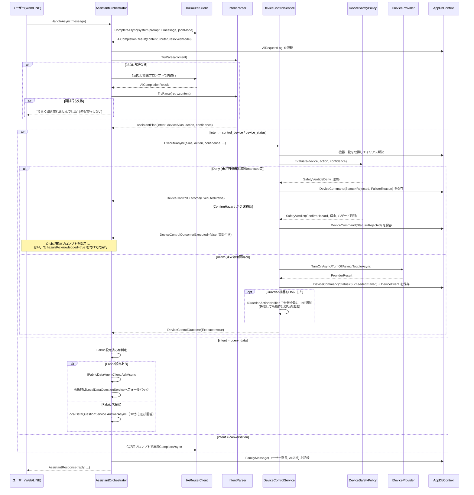
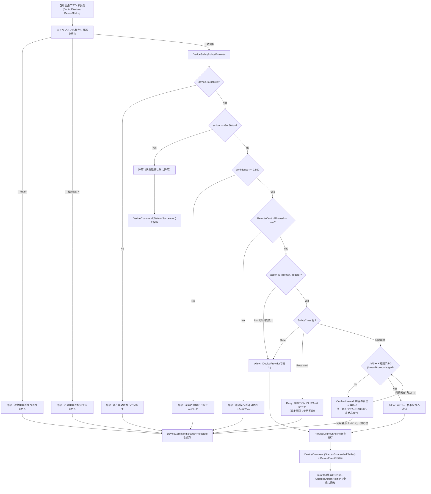

# アーキテクチャ

## レイヤーと依存方向

```
MimamoriTai.Web  ──depends on──>  MimamoriTai.Infrastructure  ──depends on──>  MimamoriTai.Core
```

- **MimamoriTai.Core**（ドメイン層／アプリケーション層）
  - `Domain/Entities.cs`, `Domain/Enums.cs`: エンティティと列挙型。EF Coreに依存しない素のPOCO。
  - `Abstractions/*.cs`: `IAiRouterClient`, `IDeviceProvider`, `IDeviceProviderFactory`, `IDataSourceContext`, `IFabricDataAgentClient`, `IEventStreamPublisher`, `ILineMessagingClient`, `ISwitchBotClient`, `ICurrentUserAccessor`, `IAppDbContext` などのインターフェース。**Core はどの外部サービスにも直接依存しない**。
  - `Application/*.cs`: `AssistantOrchestrator`, `DeviceControlService`, `DeviceSafetyPolicy`, `IntentParser`, `RiskAssessmentService`, `ActivityService`, `HouseholdTime`, `LocalDataQuestionService`, `WatchAlertService`（LINE見守りアラート、詳細は `docs/LINE_SETUP.md`）、`HouseholdAccessService`（ユーザー・世帯のアクセス制御、詳細は下記「ユーザーとデータソースの切り替え」）などのユースケース実装。I/Oは `Abstractions` 経由でのみ行う。
  - 依存先: `Microsoft.EntityFrameworkCore`（`DbSet<T>` の型としてのみ）。外部サービスSDKには依存しない。

- **MimamoriTai.Infrastructure**（実装層）
  - `Data/`: `AppDbContext`（`IAppDbContext` 実装）、`AppDbContextFactory`（デザインタイム用）、`DemoDataSeeder`。
  - `Devices/`: `ISwitchBotClient` の実装 `SwitchBotClient`、`IDeviceProvider` の実装 `SwitchBotDeviceProvider` と `MockDeviceProvider`、`IDeviceProviderFactory` の実装 `DeviceProviderFactory`、両者を束ねて `IDataSourceContext.Mode` に応じて実体を選択する `DataSourceAwareDeviceProvider`（`IDeviceProvider` として登録される実体はこれ）。
  - `Auth/`: `ICurrentUserAccessor` の既定実装 `DevCurrentUserAccessor`（固定デモユーザーを返す。詳細は下記）。
  - `Ai/`: `IAiRouterClient` の実装 `AzureModelRouterClient` と `MockAiRouterClient`。
  - `Fabric/`: `IFabricDataAgentClient` の実装として `MockFabricDataAgentClient`（未設定時、常に `IsConfigured = false`）と `FabricDataAgentMcpClient`（実MCPクライアント。JSON-RPC 2.0でFabric Data AgentのMCPエンドポイントに `initialize` → `notifications/initialized` → `tools/list` → `tools/call` の順で問い合わせ、`application/json`/SSE(`text/event-stream`)どちらのレスポンスも解釈する。認証は`Azure.Identity`の`TokenCredential`を`EventhouseStreamPublisher`と共用）。`IEventStreamPublisher` の実装 `EventHubEventStreamPublisher`（Eventstream の Event Hub カスタムエンドポイントへ送る主経路）、`EventhouseStreamPublisher`（Eventhouseへの直接ストリーミング取り込み。上の失敗時のフォールバック）、両者を束ねる `FallbackEventStreamPublisher`、および `MockEventStreamPublisher`。
  - `Line/`: `ILineMessagingClient` の実装 `LineMessagingClient` と `MockLineMessagingClient`、および共有の `LineSignature`（HMAC検証）。
  - `ServiceCollectionExtensions.cs`: **すべての実装／モックの選択ロジックがここに集約されている**唯一の場所。

- **MimamoriTai.Web**（プレゼンテーション層）
  - `Components/Pages/Home.razor`: ダッシュボードUI（Blazor Server, `@rendermode InteractiveServer`）。データソース切り替えの「データソース」ドロップダウン（アクセス可能な世帯を「サンプル: ○○」「本番: ○○」として一覧表示）、サンプル／本番データのバッジチップ、本番世帯が未作成の場合に表示される「本番データを開始」ボタン（`HouseholdAccessService.EnsureProductionHouseholdAsync` → `DeviceSyncService` を実行）、「実機を同期」ボタン（`DeviceSyncService`呼び出し）、「Fabricへ送信」ボタン（`IEventStreamPublisher`呼び出し）を表示する。選択中の世帯IDは `wwwroot/ui.js` のCookieヘルパー経由で永続化され、再読み込み後も復元される（プリレンダー中はJS interopを一切呼ばないため例外は発生しない）。
  - `Services/DashboardService.cs`: 画面表示用の読み取りモデル (`DashboardModel`) を組み立てる。`LoadAsync` は必ず `HouseholdAccessService.CanAccessAsync` でアクセス権を検証してから読み込み、`IDataSourceContext` を対象世帯のモードに設定した上で `IDeviceProviderFactory` からプロバイダを解決する。
  - `Endpoints/ApiEndpoints.cs`, `WebhookEndpoints.cs`, `SimulatorEndpoints.cs`, `AlertEndpoints.cs`, `DeviceSyncEndpoints.cs`: Minimal API。世帯IDを扱うすべてのエンドポイントは `HouseholdAccessService.CanAccessAsync` を通し、権限が無ければ403を返す（LINE Webhookは匿名のシステムコールバックのため例外。詳細は下記）。`SimulatorEndpoints` はサンプル世帯以外では400を返す。
  - `Services/WatchAlertBackgroundService.cs`: `IHostedService`。既定世帯の見守りアラートを定期的に評価する。
  - `Services/SwitchBotPollingBackgroundService.cs`: `IHostedService`。**本番（Production）データソースの世帯のみ**を対象に、`IDeviceProviderFactory.Get(DataSourceMode.Production)` で解決したプロバイダを使い実機のステータスを定期ポーリングしON/OFF・人感・開閉の状態変化を `DeviceEvent`（`Source=SwitchBotPoll`）としてAzure SQLに記録する。保存に成功したイベントは、続けて `IEventStreamPublisher` へ1回のバッチ呼び出しでも送信する（Fabric Eventhouseへのリアルタイム分析パス）。Fabricへの送信が失敗してもポーリングループは継続する（Azure SQLが正のデータストア）。本番世帯が1件も存在しない場合はDebugログを1行出すだけで即座に終了するため、デモ経路・既存テストへの影響はない。ステータスポーリングとは別に、既定60分間隔（`SwitchBot:DeviceDiscoveryIntervalMinutes`）で機器一覧も自動再取得し、`DeviceSyncService.SyncAsync(deactivateMissing: false)` で新規機器のみを追加する（実機側から消えた機器の無効化は一時的なAPI障害と区別できないため行わず、手動同期に委ねる）。
  - `Program.cs`: DI登録、DB初期化（マイグレーション or `EnsureCreatedAsync` + デモシード）。

## 抽象化とモック戦略

`MimamoriTai.Infrastructure/ServiceCollectionExtensions.cs` の `AddMimamoriTaiInfrastructure` が、設定値の有無に応じて実装とモックを切り替える唯一の分岐点です。

| インターフェース | 設定が無い場合 | 設定がある場合 |
|---|---|---|
| `IDeviceProvider` | `MockDeviceProvider`（`SwitchBotOptions.IsConfigured` が false の時に登録） | `SwitchBotDeviceProvider`（`SwitchBotOptions.IsConfigured` が true の時のみ登録） |
| `IAiRouterClient` | `MockAiRouterClient` | `AzureModelRouterClient`（`AzureModelRouterOptions.IsConfigured` が true の時のみ登録） |
| `IFabricDataAgentClient` | `MockFabricDataAgentClient`（`FabricOptions.IsConfigured` が false の時に登録） | `FabricDataAgentMcpClient`（`FabricOptions.IsConfigured` が true の時のみ登録。MCP/JSON-RPC経由でFabric Data Agentに接続） |
| `IEventStreamPublisher` | `MockEventStreamPublisher`（`EventStream`・`Eventhouse` どちらも未設定の時に登録） | 両方設定済みなら `FallbackEventStreamPublisher`（主経路 `EventHubEventStreamPublisher` → 失敗時のみ `EventhouseStreamPublisher`）。片方だけならその実装単体 |
| `IPlugMiniReadingStreamPublisher` | `MockPlugMiniReadingStreamPublisher`（`EventhouseOptions.IsConfigured` が false の時に登録） | `EventhousePlugMiniReadingStreamPublisher`（`EventhouseOptions.IsConfigured` が true の時のみ登録。`DeviceEvents` とは別テーブル `SwitchBotPlugReadings` へ送信、詳細は `docs/FABRIC_SETUP.md`） |
| `ICredentialProtector` | 常に `DataProtectionCredentialProtector`（ASP.NET Core Data Protectionのラッパー。開発環境は既定のローカルキーリング、非開発環境は `DataProtection:KeyDirectory` 未設定だと起動時に例外で即座に失敗する） | — |
| `ILineMessagingClient` | `MockLineMessagingClient` | `LineMessagingClient`（`LineOptions.IsConfigured` が true の時のみ登録） |
| `IAppDbContext` (`AppDbContext`) | SQLite ファイル (`mimamoritai-demo.db`) | 接続文字列があれば SQL Server |

**世帯ごとのSwitchBot認証情報への移行**: 上表の `IDeviceProvider`/`SwitchBotDeviceProvider` はグローバル `SwitchBotOptions`（開発用ブートストラップ）を使う経路として引き続き存在するが、本番運用では世帯オーナーが `/settings/switchbot` で入力したToken/Secretを `SwitchBotConnection`（暗号化保存）として世帯ごとに持ち、`IHouseholdSwitchBotClientFactory` が世帯ごとに独立した `ISwitchBotClient`/`IDeviceProvider` を都度生成する。詳細は本ファイル後段「世帯ごとのSwitchBot認証情報とポーリング」節、および `docs/SECURITY.md`/`docs/SWITCHBOT_SETUP.md` を参照。

**実機（SwitchBot）への切り替え**: `SwitchBotDeviceProvider` はSwitchBot OpenAPI v1.1のレスポンス（`GET /v1.1/devices` の `deviceList`/`infraredRemoteList`、`GET /v1.1/devices/{id}/status` の機種別フィールド）を実装済みで、`statusCode` が100以外の場合や不正なJSONは例外を投げず失敗として扱う（詳細は `docs/SWITCHBOT_SETUP.md`）。`SwitchBot:Enabled=true`＋Token/Secretで有効化した後、`DeviceSyncService`（ダッシュボードの「実機を同期」ボタン、または `POST /api/devices/sync`）を実行して実機の機器一覧をDevicesテーブルへ反映する。反映済みの機器は `SwitchBotPollingBackgroundService` が定期的（既定5分、`SwitchBot:PollIntervalMinutes`）にステータスをポーリングし、ON/OFF・人感・開閉の変化を `DeviceEvent`（`Source=SwitchBotPoll`）として記録するため、リスク判定・アラートも実データに基づいて動作する。

各モックは「設定が無ければ安全に倒れる」ことを目的としており、`IsConfigured` プロパティを通じて呼び出し側（`AssistantOrchestrator` や `DashboardService`）が実接続かどうかを判定できます。

**設定値がどこから来るか**: 上表の分岐はすべて `IConfiguration` の値だけを見ています。値の出所は環境ごとに異なり、ローカルでは `appsettings.json`（空のプレースホルダー）＋ User Secrets、Azure では **Azure Key Vault** です。`Program.cs` の先頭で `AddMimamoriTaiKeyVault()`（`Web/Services/KeyVaultConfigurationExtensions.cs`）が `KeyVault:Uri` を見て、設定されていればマネージドID（`DefaultAzureCredential`）で Key Vault を構成プロバイダーとして重ねます。**インフラ層はこの違いを知りません** — `IsConfigured` が true になった理由が User Secrets か Key Vault かで挙動は変わりません。`KeyVault:Uri` が空なら Key Vault は参照されず、秘密情報ゼロのモード（`dotnet run` だけで全機能）がそのまま維持されます。詳細は `docs/SECURITY.md`。

## リアルタイム分析パス（Fabric Eventhouse）

SwitchBot実機のデータは、Azure SQL（`mimamori.DeviceEvents`、**正のデータストア**）に加えて、Microsoft Fabric Eventhouse（KQLデータベース）へもストリーミングされ、リアルタイム分析・可視化に利用できます。

```
SwitchBot Cloud →(5分ポーリング)→ Web App → Azure SQL (mimamori.DeviceEvents, 正)
                                          └→ Eventstream → Fabric Eventhouse (KQL)
                                          └────（失敗時のフォールバック）────┘
```

- **これはポーリングであり、push通知ではありません。** `SwitchBotPollingBackgroundService` が既定5分間隔でSwitchBotのステータスAPIを呼び出し、前回の状態から変化があった場合のみ `DeviceEvent` を記録します。
- Azure SQLへの保存が完了した後、同じバッチを1回のHTTP呼び出しで Fabric Eventhouse の `DeviceEvents` テーブルへストリーミング取り込み（`v1/rest/ingest/{database}/{table}?streamFormat=json&mappingName={mapping}`）します。認証は **`Azure.Identity` の `DefaultAzureCredential` によるパスワードレス**（Web Appのシステム割り当てマネージドIDに `ingestors` ロールを付与済み）。
- Fabricへの送信に失敗してもポーリングループ自体は中断・失敗しません（警告ログのみ）。Azure SQLが常に正となります。
- `DeviceEvents` の主経路は Eventstream **`MimamoriDeviceStream`**（Event Hub CustomEndpoint → Eventhouse）です。`FallbackEventStreamPublisher` が、この経路に失敗したときだけ Eventhouse への直接RESTに切り替えます（`EventHubEventStreamPublisher` → `EventhouseStreamPublisher`）。Eventstream の宛先が Paused になっても取りこぼさないための冗長化で、**着地先はどちらも同じ Eventhouse** です。`SwitchBotPlugReadings` はホップを増やさず直接RESTのみです。
- **この Eventhouse を運用コンソールは読みません。** コンソールが読むのは `FabricConsoleSync` が書く Fabric SQL Database だけで（Rayfin の GraphQL 経由）、Eventhouse を読むのは Fabric Data Agent です。つまり Eventstream 経路と `FabricConsoleSync` は、同じデータの本番／予備ではなく、**運ぶ中身も宛先も読み手も違う並列の2経路**です。
- 手動での動作確認用に `POST /api/stream/publish?take=N`（既定50件）を用意しており、直近のDeviceEventを再度Fabricへ送信して疎通を確認できます。ダッシュボードの「Fabricへ送信」ボタンからも同じ経路を呼び出せます。

### 設定 (`Eventhouse:*`)

| キー | 既定値 | 説明 |
|---|---|---|
| `Eventhouse:Enabled` | `false` | `true` にすると実Eventhouseへのストリーミングを有効化 |
| `Eventhouse:ClusterUri` | `""` | EventhouseのエンジンURI（例: `https://<cluster>.z2.kusto.fabric.microsoft.com`。**`ingest-<cluster>` ホストではなくエンジンホストを指定すること** — ストリーミング取り込みは `ingest-` ホストでは404になる） |
| `Eventhouse:DatabaseName` | `MimamoriEventhouse` | KQLデータベース名 |
| `Eventhouse:TableName` | `DeviceEvents` | 取り込み先テーブル名 |
| `Eventhouse:MappingName` | `DeviceEventsMapping` | JSON取り込みマッピング名 |
| `Eventhouse:TimeoutSeconds` | `30` | HTTPタイムアウト（秒） |

秘密情報は一切含みません（トークンは `DefaultAzureCredential` が都度取得し、有効期限の5分前になったらキャッシュを更新します）。

## ユーザーとデータソースの切り替え（マルチユーザー分離）

複数ユーザーが同じアプリを使っても互いのデータが見えないようにするための土台を実装している。**この節は将来のEntra External ID / LINE OIDC認証タスクが接続する「継ぎ目（seam）」を明示するためのものでもある。**

### ユーザーモデル

| エンティティ | 目的 | 主なフィールド |
|---|---|---|
| `AppUser` | アプリ内のユーザー（IdPに依存しない共通表現） | `IdentityProvider`（`"dev"`/`"entra-external"`/`"line"`など）, `ExternalSubject`（IdPの安定した`sub`/`oid`）, `LineUserId`（任意）, `DisplayName`, `Email`, `CreatedAtUtc`, `LastLoginAtUtc`。`(IdentityProvider, ExternalSubject)` にユニークインデックス。 |
| `HouseholdMember` | ユーザーと世帯の関連（役割付き） | `HouseholdId`, `AppUserId`, `Role`（`HouseholdMemberRole`: `Owner`/`Member`/`Viewer`）, `CreatedAtUtc`。`(HouseholdId, AppUserId)` にユニークインデックス。 |

### 認証の継ぎ目: `ICurrentUserAccessor`

`Core/Abstractions/ICurrentUserAccessor.cs` が「今誰がリクエストしているか」を表す唯一のインターフェース。

```csharp
public sealed record CurrentUser(Guid AppUserId, string DisplayName, string IdentityProvider, string ExternalSubject, bool IsAuthenticated);
public interface ICurrentUserAccessor { CurrentUser? Current { get; } }
```

現在のDI既定実装は `Infrastructure/Auth/DevCurrentUserAccessor.cs` で、**設定・ログイン一切不要**の固定デモユーザー（`AppUserId = 11111111-1111-1111-1111-111111111111`, `IdentityProvider = "dev"`, `IsAuthenticated = false`）を常に返す。**将来の実認証タスクがやるべきことは、`ServiceCollectionExtensions.cs` でこの1行のDI登録をクレームベースの実装（`HttpContext.User` から `CurrentUser` を組み立てるもの）に差し替えるだけ。** `HouseholdAccessService` や各エンドポイントの `CanAccessAsync` 呼び出しなど、それ以外のコードは一切変更不要で動作し続ける設計。

### 実認証の実装: OpenID Connect（Entra External ID / LINE Login）

上記の継ぎ目に実装した認証機能。`Auth:Enabled=false`（既定値）の場合は本節の内容は一切有効化されず、アプリは今まで通り匿名のデモモードで動く。

- **設定**: `Infrastructure/Auth/AuthOptions.cs`（`Auth:*` セクション）。`Enabled`/`Authority`/`ClientId`/`ClientSecret` の4つが揃って初めて `IsConfigured = true` になる。`Authority` が `https://access.line.me` の場合は `IsLineAuthority = true` となり、LINE Login固有の分岐（後述）が有効になる。
- **DI配線**: `Web/Services/AuthenticationExtensions.cs` の `AddMimamoriTaiAuthentication` が唯一の追加ポイント。`IsConfigured` が false の間は `AddAuthentication()`/`AddAuthorization()` を引数なしで登録するだけ（`Program.cs` が無条件に呼ぶ `UseAuthentication`/`UseAuthorization` がスキームなしでも動作するため）で、Cookie/OIDCスキームは一切追加されず `ICurrentUserAccessor` も `DevCurrentUserAccessor` のまま。`IsConfigured` が true になって初めて Cookie（既定スキーム）+ OpenID Connect（チャレンジスキーム）を追加し、DI登録を `Web/Services/ClaimsCurrentUserAccessor.cs` に差し替える。
- **Entra External ID発行者検証の罠**: Entra External IDのディスカバリー文書が返す `issuer` は `https://<tenantId>.ciamlogin.com/<tenantId>/v2.0`（テナントIDサブドメイン）だが、`Authority` に設定するのはカスタムサブドメイン形式（`https://<subdomain>.ciamlogin.com/<tenantId>/v2.0`）であることが多い。両方を `TokenValidationParameters.ValidIssuers` に含めないと `IDX10205`（発行者不一致）でサインインが失敗する。
- **リバースプロキシ対応**: Azure App Service配下ではTLS終端がプロキシ側で行われるため、`X-Forwarded-Proto`/`X-Forwarded-For` を信頼しないと `redirect_uri` が `http://` になりOIDCが失敗する。`UseMimamoriTaiForwardedHeaders()`（`UseAuthentication` より前に呼び出し）が `ForwardedHeadersOptions.KnownIPNetworks`/`KnownProxies` をクリアして全プロキシを信頼する設定にしている。
- **AppUserの初回サインイン時プロビジョニング**: `ICurrentUserAccessor.Current` は同期プロパティなので、その中でDBのupsertを非同期に行うことはできない。代わりにOIDCの `OnTokenValidated` イベント（`CurrentUserAccessorFactory`）で `HouseholdAccessService.EnsureUserAsync` を1回だけ呼び、生成/更新された `AppUser.Id` を `mimamori:uid` というカスタムクレームとしてプリンシパルに追加する。`ClaimsCurrentUserAccessor` はこのクレームを読むだけなので同期的に動作できる。本番世帯（`EnsureProductionHouseholdAsync`）はここでは自動作成しない — 既存の「本番データを開始」ボタンによる明示的なオプトインのまま。
- **LINE Loginを直接使う場合**: `Auth:Authority` に `https://access.line.me` を設定するだけで、同じOIDCパイプラインで動作する。LINEは `offline_access` スコープをサポートしないため、`IsLineAuthority` が true の間はこのスコープをリクエストしない。`idp` クレームに `line` を含む場合、またはLINEを直接使う場合は `CurrentUser.IdentityProvider` が `"line"` として報告され、`AppUser.LineUserId` にも `sub` クレームの値が保存される。認証パイプライン自体は1本のままで、Entra External ID経由でLINEを連携させる構成・LINEに直接向ける構成の両方をコード変更なしにサポートする。
- **エンドポイント**（`Web/Endpoints/AuthEndpoints.cs`）: `GET /auth/login?returnUrl=`（OIDCチャレンジ）、`GET /auth/logout`（Cookie/OIDC両スキームからサインアウト）、`GET /auth/me`（`{ authenticated, displayName, provider, appUserId }` のJSON、動作確認用）。いずれも `Auth:Enabled=false` の間は例外を投げず日本語の案内文を返す。
- **UI**: `Home.razor` のヘッダーに `.account` ブロックを追加。`Auth:Enabled` が false なら「デモモード（未認証）」の中立チップ、true かつ未認証なら「ログイン」リンク、true かつ認証済みならユーザー名チップ＋「ログアウト」リンクを表示する（既存の `.chip`/`.ghost` 規約を踏襲）。`[Authorize]` はアプリ全体には付けておらず、`Auth:Enabled=false` の間はダッシュボードは常に匿名でレンダリングされる。

### 世帯アクセス制御: `HouseholdAccessService`

`Core/Application/HouseholdAccessService.cs`（スコープドサービス）が全ての可否判定・世帯作成の中心：

- `EnsureUserAsync(CurrentUser, ct)`: `(IdentityProvider, ExternalSubject)` で `AppUser` をupsertし、`DisplayName`/`Email`/`LineUserId`/`LastLoginAtUtc` を更新する。
- `ListAccessibleAsync(ct)` / `CanAccessAsync(householdId, ct)`: **サンプル（Sample）世帯は全ユーザーが閲覧可能**（共有デモデータのため）。**本番（Production）世帯は `HouseholdMember` レコードを持つユーザーのみ**アクセス可能。
- `EnsureProductionHouseholdAsync(name, ct)`: 現在のユーザー用の本番世帯（`DataSourceMode.Production`）と `HouseholdMember`（Owner）、`Person`（`PersonRole.Resident`）を作成する。**冪等**（既に本番世帯を所有していればそれを返す）。内部で `EnsureUserAsync` を先に呼ぶため、未シードのDBに対しても安全に呼び出せる（自己修復）。
- `ResolveDefaultAsync(ct)`: ユーザー自身の本番世帯があればそれを、無ければ最も古いサンプル世帯を返す。

`DashboardService.LoadAsync` と `Endpoints/*.cs` の世帯IDを扱う全エンドポイントは、必ず `CanAccessAsync` を最初に呼び、拒否された場合は `LoadAsync` は `null`、エンドポイントは `403 Forbidden`（日本語メッセージ）を返す。これにより、あるユーザーが他ユーザーの本番データを閲覧・操作することは構造的に不可能になっている。

例外: `WebhookEndpoints.cs` のLINE Webhookはサインイン済みユーザーのコンテキストを持たない匿名のシステムコールバックであるため、`CanAccessAsync` は呼ばない。世帯の解決は「その送信元（userId/groupId）に対応する既存の有効な `LineRecipient` があればその世帯」を最優先し、未リンクの送信元は `Line:AllowDefaultHouseholdFallback=true`（既定false、`appsettings.Development.json` でのみtrue）の場合に限り `ResolveDefaultAsync` にフォールバックする（署名検証は既存の `LineSignature` によるHMAC検証で担保）。詳細は `docs/LINE_SETUP.md`「世帯とLINEを紐付ける（連携コード）」を参照。

### データソース切り替え: `DataSourceMode` / `IDeviceProviderFactory` / `IDataSourceContext`

`Household.DataSourceMode`（`Sample` / `Production`）が世帯ごとのデータソースを表す。`Sample`＝共有デモデータ、`Production`＝ユーザー自身の実データ（実SwitchBot機器など）。

- `IDeviceProviderFactory.Get(DataSourceMode)`: `Sample` は常に `MockDeviceProvider`。`Production` は `SwitchBotOptions.IsConfigured` なら `SwitchBotDeviceProvider`、未設定なら **例外を投げず** `MockDeviceProvider` にフォールバックする（本番世帯を作っても未設定なら引き続きデモとして動く）。
- `IDataSourceContext`（スコープド, `Mode`/`HouseholdId` を保持）: `IDeviceProvider` として実際にDIへ登録されるのは `DataSourceAwareDeviceProvider`（デコレーター）で、呼び出しの都度 `IDataSourceContext.Mode` を読んで `IDeviceProviderFactory` から実体を解決する。そのため `DeviceControlService`／`DeviceSyncService`／`AssistantOrchestrator`／`DashboardService` など既存の呼び出し側は変更不要でコンパイルが通るが、**各処理の入口（`DashboardService.LoadAsync`、`DeviceSyncEndpoints`、バックグラウンドサービス）が明示的に `IDataSourceContext.Mode`/`HouseholdId` を設定してから使う**必要がある。
- `SwitchBotPollingBackgroundService` は本番世帯のみをポーリング対象とし（上記参照）、`SimulatorEndpoints` はサンプル世帯以外では400を返す（本番データを偽イベントで汚染しないため）。

### 世帯ごとのSwitchBot認証情報とポーリング（`SwitchBotConnection` / `IHouseholdSwitchBotClientFactory`）

従来は `SwitchBotOptions`（`SwitchBot:Token`/`Secret`、User Secrets/App設定のグローバル1組）のみで全世帯を一括してポーリングしていた。これを世帯ごとの暗号化済み認証情報に置き換えた（詳細は `docs/SECURITY.md`「世帯ごとのSwitchBot認証情報」/ `docs/SWITCHBOT_SETUP.md`「本番運用」参照）。

- `SwitchBotConnection`（世帯ごとに最大1件）の `EncryptedToken`/`EncryptedSecret` は `ICredentialProtector`（`Infrastructure/Security/DataProtectionCredentialProtector.cs`、ASP.NET Core Data Protectionのラッパー、purpose文字列 `"MimamoriTai.SwitchBotCredentials.v1"`）で暗号化して保存する。復号は `IHouseholdSwitchBotClientFactory`（`Infrastructure/Devices/HouseholdSwitchBotClientFactory.cs`）の呼び出しごとの短命なスコープ内でのみ行い、復号済みの値をキャッシュ・共有することはない（世帯Aの認証情報が世帯Bの処理に混入しないことを `HouseholdSwitchBotClientFactoryTests` で回帰テストしている）。
- **設定画面**: 認証済みの世帯オーナーのみが `/settings/switchbot`（`SwitchBotSettings.razor` + `Web/Endpoints/SwitchBotConnectionEndpoints.cs`）でToken/Secretを入力できる。保存前に必ず実際の `GET /v1.1/devices` 呼び出しで検証し、成功した場合のみ暗号化して保存する。UIは接続状態（未設定/接続済み/エラー）と最終検証・同期日時のみを表示し、保存済みの秘密情報を再表示することはない。エンドポイントは認証必須（`RequireAuthorization`）かつBlazor Serverの標準Antiforgery（`UseAntiforgery()`）で保護されている。
- `SwitchBotOptions.AllowGlobalFallback`（既定false）を明示的にtrueにした場合のみ、世帯に `SwitchBotConnection` が無いときの最終手段としてグローバル `SwitchBotOptions` を使う（ローカル開発のブートストラップ専用の位置づけ）。
- **ポーリング**: `SwitchBotPollingCycleService`（`Core/Application/`、DIやHTTPに依存しないテスト容易なコア）が1周期あたりの処理（機器一覧取得→状態変化なら`DeviceEvent`挿入→Plug Miniクラスの機器は状態変化の有無に関わらず`PlugMiniReading`を1行挿入→重複排除）を担い、`SwitchBotPollingBackgroundService`（`Web/Services/`）が対象世帯ごとに独立したDIスコープを生成してこのコアを呼び出す。1つの世帯の処理中の例外が他世帯のポーリングを止めないよう、世帯単位でtry/catchしている。
- **Fabricへの発行**: `PlugMiniReadingPublishService`（`Core/Application/`）が `DeviceEvent`/`EventStreamPublishService` と同じ「未発行分だけをバッチ処理し、成功した行にのみ `PublishedToStreamAtUtc` を刻む」パターンで `IPlugMiniReadingStreamPublisher`（実装: `EventhousePlugMiniReadingStreamPublisher`、モック: `MockPlugMiniReadingStreamPublisher`）へ送る。`PlugMiniReadingPublishBackgroundService` が定期実行する。テーブルスキーマは `docs/FABRIC_SETUP.md` 参照。

### UI

`Home.razor` のヘッダーに「データソース」ドロップダウン（`サンプル: ○○` / `本番: ○○`）と、選択中データソースを示すバッジ（「サンプルデータ」＝ミュート色 / 「本番データ」＝アクセントカラー、既存の`.chip`規約を踏襲）を追加。本番世帯が無いユーザーには「本番データを開始」ボタンを表示し、押下すると `EnsureProductionHouseholdAsync` → `DeviceSyncService.SyncAsync`（実SwitchBot機器の取り込み）を実行してからその世帯に切り替える。選択中の世帯IDは `wwwroot/ui.js` の単純なCookieヘルパー経由で永続化し、`OnAfterRenderAsync`（プリレンダー完了後にのみ呼ばれる）から復元するため、プリレンダー中にJS interopが呼ばれることはない。

## データモデル

| エンティティ | 目的 | 主なフィールド |
|---|---|---|
| `Household` | 見守り対象の世帯 | `Name`, `People`, `Devices`, `DataSourceMode`（`Sample`/`Production`） |
| `Person` | 世帯の構成員（本人／家族／管理者） | `DisplayName`, `Role`（`PersonRole`） |
| `AppUser` | アプリ内のユーザー（上記「ユーザーとデータソースの切り替え」参照） | `IdentityProvider`, `ExternalSubject`, `LineUserId`, `DisplayName`, `Email` |
| `HouseholdMember` | ユーザーと世帯の関連（役割付き） | `HouseholdId`, `AppUserId`, `Role`（`HouseholdMemberRole`） |
| `Device` | 家電機器 | `ExternalDeviceId`, `Alias`, `DeviceType`, `Provider`, `RemoteControlAllowed`, `SafetyClass`, `IsActive`（プロバイダから消えた機器を削除せず無効化するためのフラグ） |
| `DeviceEvent` | 家電の状態変化イベント（ON/OFF等） | `State`, `PowerWatts`, `Source`（`EventSource`: `Seed`/`Mock`/`Simulator`/`AppCommand`/`SwitchBotWebhook`/`SwitchBotPoll`）, `OccurredAtUtc` |
| `SwitchBotConnection` | 世帯ごとの暗号化済みSwitchBot認証情報（1世帯1件、詳細は `docs/SECURITY.md`） | `HouseholdId`（ユニーク）, `EncryptedToken`, `EncryptedSecret`, `Status`（`SwitchBotConnectionStatus`: `NotConfigured`/`Connected`/`Error`）, `LastValidatedAtUtc`, `LastSyncAtUtc`, `LastErrorMessage`（秘密情報は含まない） |
| `PlugMiniReading` | Plug Miniの毎ポーリング周期の電力テレメトリ（状態変化の有無に関わらず記録、詳細は `docs/FABRIC_SETUP.md`） | `HouseholdId`, `DeviceId`, `VoltageV`, `CurrentMa`, `DailyEnergyWh`, `UsageMinutesToday`, `ApproxWatts`, `OccurredAtUtc`, `PublishedToStreamAtUtc` |
| `LineLinkCode` | 世帯とLINE送信元を紐付けるための短命な使い捨てコード（詳細は `docs/LINE_SETUP.md`） | `HouseholdId`, `CodeHash`（平文は保存しない）, `ExpiresAtUtc`, `UsedAtUtc`, `AttemptCount` |
| `DeviceCommand` | 自然言語／API経由の操作要求（**成功・失敗・拒否すべて記録**） | `Action`, `Status`（`CommandStatus`）, `FailureReason`, `AiResolvedModel` |
| `FamilyMessage` | 家族間・AIとのメッセージ（チャット/LINE） | `Content`, `MessageType`, `Source` |
| `RiskAssessment` | 見守りリスク判定の履歴 | `RiskLevel`, `Score`, `Reason` |
| `WatchAlert` | LINE見守りアラートの送信履歴（重複防止のクールダウン判定にも使用） | `PersonId`, `RiskLevel`, `Score`, `Reason`, `Message`, `SentAtUtc`, `Success`, `Error` |
| `DailyActivitySummary` | 日次の活動サマリー（現状は`ActivityService`が都度計算し、このテーブルへの永続化は未実装） | `FirstActivityTime`, `DeviceUsageCount`, `NightActivityCount` |
| `AiRequestLog` | AIルーター呼び出しの監査ログ | `Purpose`, `Router`, `ResolvedModel`, `DurationMs`, `Success` |

## アシスタント処理フロー（シーケンス図）

`AssistantOrchestrator.HandleAsync` は、Webのチャット・LINEシミュレーター・実LINE Webhookのいずれからも同じ入口として呼ばれます。



## 安全ガードレールのフロー



重要な設計判断:
- 判定ロジックは `DeviceSafetyPolicy` に集約され、I/Oを持たないため単体テストが容易。
- **判定結果は文字列ではなく `SafetyVerdict`（`Allow` / `ConfirmHazard` / `Deny`）という型**。二値では「はい、ただし周囲を確認してから」を表現できず、危険な家電を一律に拒否するしかなくなる。寒い日に高齢の家族がストーブを扱えないとき、遠隔で何もできないことの方が危険な場合がある。
- **ハザード確認の関門は `DeviceControlService`（サービス層）にある**。会話フローだけに置くと、APIを直接呼べば質問をスキップできてしまうため。Web の ON ボタンも同じサービスを通るので、`DeviceDetail.razor` / `Home.razor` は JS の `confirm` で同じ質問を提示してから `hazardAcknowledged: true` を渡す。
- **通知は `SaveChangesAsync` の後に実行し、例外は握り潰す**。家電はすでにONになっているため、LINE の送信失敗を「操作が失敗した」と家族に読ませてはいけない。
- **拒否も含めすべての試行が `DeviceCommand` として監査可能**（`DeviceControlService.RejectAsync`）。
- LLMの出力（`confidence`, `deviceAlias`）は信用されず、必ずルールベースの `Evaluate` を通過する。ハザード確認も同様で、モデルが「確認済み」と申告しても実際の確認ターンを経ていなければ実行されない。
