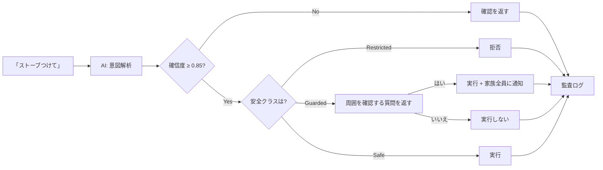
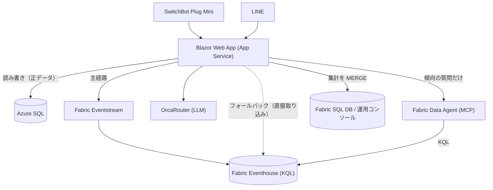

# 離れて暮らす高齢の家族を見守るサービスを作った ― 本人は「エアコンつけて」、家族は LINE で様子がわかる（Azure + Microsoft Fabric + OrcaRouter）

> ハッカソン提出作品「**CareRoute AI / 見守り隊**」の開発記録です。
> 足腰が弱ってくると、リモコンを取りに行くこと自体が一仕事になります。本人は**移動せずに話しかけるだけ**で家電を操作でき、離れて暮らす家族はその様子から**カメラなしで**生活リズムを把握できる、というサービスを作りました。
>
> 出場した大会: [AI HACK 2026｜賞金総額100万円のAIハッカソン（東京・9日間）](https://aihackathon.jp/)
> Qiita 公開版: https://qiita.com/monoqlo78/items/27ea5bfa760bd8e3c3b7

**まず、動いているところから。**


家じゅうのデバイスから届いたイベントが、Azure SQL と Microsoft Fabric へ流れていく様子です。WebGL で描いていて、**映っている数字はダミーではなく、その時点の実データ**です。下段に「同期ジョブ 停止中」と出ているのも演出ではなく、本当に止まっている状態です（3章）。


ダッシュボードに住んでいる3Dマスコットの「ミマモ」です。**話しかけると反応します**。これも既製の素材ではなく、**自作の MCP サーバー**で Blender を動かして自分でモデリングしました（6章）。

▶ **通しのデモ動画（5分51秒・ナレーション＋字幕入り）**: 原本は [docs/demo/mimamoritai-demo.mp4](https://github.com/monoqlo78/mimamoritai-careroute-ai/blob/main/docs/demo/mimamoritai-demo.mp4)。YouTube 版（https://youtu.be/TnM-RHFZ_Lc ）は音声操作と安全確認を収めた先行版です

この記事は「作ったもの紹介」半分、「壊れ方の記録」半分です。とくに後半の**沈黙して壊れた4つの障害**は、同じ構成を組む人には役に立つと思います。

LLM は今回のハッカソン **[AI HACK 2026](https://aihackathon.jp/)** で提供された **[OrcaRouter](https://www.orcarouter.ai/)** を使いました。OpenAI 互換のエンドポイントに投げるだけで、その時いちばん都合のいいモデルへ自動で振り分けてくれます。**モデルを選ばなくていいのは本当に楽でした**。ただ、楽なぶんだけ「自動で選ばれるからこそ壊れる」場面にも当たりました。そこをどう畳んだかは 3-1 に書いています。


---

## 1. 作ったもの

作りたかったのは、**見守られる側と見守る側の両方が楽になる**サービスです。

### 本人側：移動しないで家電を操作できる

足腰が弱ってくると、「エアコンのリモコンを取りに行く」「照明のスイッチまで歩く」が、それだけで一仕事になります。夜中に寒くて起きたときに、暗い部屋を歩いてスイッチまで行くのは転倒のリスクそのものです。

なので本人は、**移動せずに「エアコンつけて」と言うだけ**で操作できるようにしました。手順や機器名を覚える必要はなく、普通の言葉で通ります。

文字とボタンを大きくした専用画面（`/one-touch`）も用意しました。見守る側と見守られる側では、必要な情報も操作量もまったく違うためです。


### 家族側：カメラを付けずに様子がわかる

一方で、離れて暮らす家族にとっては「今日は元気にしているだろうか」を毎日確認するのが地味に負担になります。かといってカメラを付けるのは、見られる側にとって受け入れ難い。

そこで **家電の ON/OFF と消費電力だけ**を見ることにしました。

- 朝、照明が点けば「起きた」
- 夜中に何度も点けば「眠れていないかもしれない」
- 昼過ぎまで何も動かなければ「いつもと違う」

映像も音声も取らないので、見られる側の心理的な負担がほぼありません。取れる情報は少ないですが、「生活リズムの変化」を見るには十分でした。

ここは作りながら一度やり直しています。最初は「今日は何 Wh 使った」という**1日の合計**を出していたのですが、合計は**その日の形**を教えてくれません。同じ 800Wh でも、朝から少しずつ使った日と、昼過ぎに一気に使った日はまったく違う日です。

なので、**24時間を時計の上に並べて、いつもの平均を線で重ねる**形に変えました。棒が線から離れているほど「いつもと違う1日」です。

そのうえで、そこから**読める言葉**を2つだけ取り出しています。

- **電気が動きはじめた時間** … その日はじめて消費電力が動いた時刻。だいたい起床に対応します
- **電気が静かになった時間** … 最後に動いた時刻。だいたい就寝に対応します

グラフを読み解くのは家族の仕事ではないので、「6時40分に動きはじめた／いつもより30分早い」まで文にして出します。棒グラフを押すと家電ごとの内わけがポップアップで開くので、「動いたのは冷蔵庫だけだった」といった確認もできます。

うまくいったと思っているのは、**本人が楽をするための操作が、そのまま家族の安心材料になる**ことです。本人が「暑いからエアコンつけて」と言えば、家族側には「今日は昼にエアコンを入れている＝普段どおり動けている」として届きます。見守るための余計な操作を、本人に一切お願いしていません。

家族側は LINE で聞くだけです。

```
娘：今日のお母さんどう？
Bot：今朝6時40分に寝室の照明が点いています。
　　 いつもより30分早い起床です。日中の活動も普段どおりです。
```

家電の操作もチャットからできます。ただし **ここが本題**で、AI に操作を任せていません。

実際の LINE 画面がこれです。


「今日の様子」を押すと、その日の家電の使われ方をまとめて返します。
このスクリーンショットでは、まだその日の記録がないので
**「記録されていません」と正直に返しています**。ここが後述の本題です。

ボタンを押すだけでも使えるようにしてあります。


「助けて」には必ず **119番の案内**が付きます。
このサービスは緊急通報の代わりにはならない、という立場を最初に示しています。

### 使う機器：市販のスマートプラグ 1 個だけ

「見守り」と聞くと、カメラや専用センサーを何個も設置する話になりがちです。この作品が家に置くのは、**家電量販店で買える SwitchBot のスマートプラグ 1 個だけ**です。工事も配線もありません。今使っている家電のプラグを抜いて、あいだに挟むだけです。


実際に本作の検証で使っている実機は、**SwitchBot プラグミニ (JP) 1 台**です（アプリ上の名前は `プラグミニ 92`、SwitchBot OpenAPI 上の `deviceType` は `Plug`）。この 1 個から、次の 4 つが取れます。

| 取れるもの | SwitchBot OpenAPI のフィールド | 見守りでの意味 |
| --- | --- | --- |
| 消費電力（W） | `electricCurrent`（mA）× `voltage`（V） | いま動いているか、止まっているか |
| その日の積算電力量 | `weight` | いつもの一日と重ねて比べる材料 |
| 通電していた時間 | `electricityOfDay`（分） | 使いすぎ・つけっぱなしの検知 |
| ON / OFF の切り替え | `turnOn` / `turnOff` コマンド | 「扇風機をつけて」で遠隔操作できる |

ここで少し面倒なのは、**プラグミニ (JP) はステータスに `power`（ON/OFF）フィールドを返さない**ことです。Bot や Color Bulb は `power: "on"` を返してくれるのに、プラグミニは電流と積算値しか返しません。なので `SwitchBotDeviceProvider` は、電流が流れているかどうかから ON/OFF を推定しています。機種ごとにレスポンスの形が違うので、ここは公式仕様（[OpenWonderLabs/SwitchBotAPI](https://github.com/OpenWonderLabs/SwitchBotAPI)）の `devices/*.md` を1つずつ読んで実装しました。

**なぜカメラではなくプラグなのか**は、技術というより受け入れやすさの問題です。カメラは、見られる側にとって受け入れ難い。一方コンセントは、本人にとって「何かを設置された」という感覚がほぼありません。取れる情報は圧倒的に少ないですが、生活リズムの変化を見るには足りました。

拡張としては、**SwitchBot ハブ経由の赤外線リモコン家電**（照明・エアコン・扇風機）も実装済みです。`GET /v1.1/devices` が返す `infraredRemoteList` を `deviceList` と同じように取り込むので、高齢者宅で多い「リモコンで動かす照明・エアコン」も同じ画面に並びます。人感センサー・開閉センサー・温湿度計の型も用意してありますが、**本作の実機構成には含みません**（持っていないものを「対応しています」とは書かない方針です）。

なお、マッピング表にない機種（Hub / Curtain / Lock / ロボット掃除機など）は `DeviceType.Unknown` に落ち、`DeviceSafetyPolicy` によって自動的に `Restricted`（遠隔操作を許可しない）として扱われます。**知らない機器は勝手に動かさない**、が既定です。

---

## 2. いちばん時間をかけたところ：AIを信用しない

「話しかけるだけで家電が動く」を本気でやるなら、**間違えたときの代償**から設計する必要があります。使う人は自分で機器のところまで行って戻せない、というのが前提だからです。

LLM に「意図を解析して家電を操作する」をやらせると、デモは一発で動きます。問題は、**間違えたときに何が起きるか**です。

「ストーブつけて」を誤解して真夏に暖房を入れる。深夜に照明を全部点ける。高齢者の家でそれをやると、便利どころか事故です。

なので、AI の出力を**そのまま実行しない**構造にしました。



設計の要点は4つです。

**(1) 機器を安全クラスで分ける。ただし「できない」で終わらせない。**
照明・扇風機は `Safe`。ヒーター類・調理器・素性の分からないプラグは `Guarded`。マッピングに無い機器は `Restricted` です。

最初の実装では、ヒーター類は `Restricted`、つまり**遠隔からは一切つけられない**にしていました。安全側に倒したつもりでした。でもこれは間違いでした。

寒い日に、認知症が始まりかけた親がストーブを自分で扱えない。そのとき家族が遠隔で何もできないというのは、**ストーブの事故より寒さの方が危険**という状況を無視しています。「危ないから禁止」は、一見安全に見えて、実際にはリスクを家の中に置き去りにしているだけでした。

なので `Guarded` という3つ目の状態を足しました。**「はい、ただし周囲を確認してから」**を表現できる状態です。

**(2) 危険な操作は、質問を1回はさむ。**
`Guarded` の機器を ON にしようとすると、機器の種類に応じた確認が返ります。ストーブなら「周りに燃えやすいもの（洗濯物、新聞紙、布団）はありませんか？」。ここで「はい」と答えて初めて通電します。

重要なのは、**この関門をサービス層（`DeviceControlService`）に置いた**ことです。会話側だけで確認していると、API を直接叩けば質問を飛ばせてしまいます。「質問しないことで迂回できる」設計は、安全機構とは呼べません。

そしてもう一つ。`Guarded` 機器が実際に ON になったら、**家族全員に LINE で通知**します。操作した本人だけが知っている状態を作らないためです。通知は「おまけ」ではなく、許可の条件の一部です。

**(3) 「絶対につけない」は、人間が個別に指定できる。**
機器の設定画面に「遠隔でONにすることを禁止する」というチェックボックスを置きました。オーナーがこれを入れた機器は `Restricted` に落ち、質問すら出さずに拒否します。

優先順位は「最も慎重な設定が勝つ」。機器タイプの既定値が、人間の明示的な指定を上書きすることはありません。

実際に本番環境で「ストーブつけて」と入力した結果がこれです。


**(4) ON と OFF を非対称にする。**
`Guarded` でも `Restricted` でも、**OFF は常に通します**。「消す」は安全性を高める方向の操作だからです。ここを対称にすると「危ないから何も操作できない」になって使い物になりません。

同じストーブに「消して」と言うと、周囲の安全確認を求められることなく、通常どおり「よろしいですか？」の1回だけで受理されます。


機器カードにも「火や熱をあつかう機器です。ONにする前に周囲の確認をお願いします（ご家族全員に通知されます）」と出しています。**ガードの理由が使う人に見えないと、ただの故障に見える**ためです。

**(5) 拒否も含めて全部記録する。**
成功・失敗・拒否のすべてを `DeviceCommand` に残します。「AIが何をしようとしたか」が後から追えないと、そもそも安全性を主張できません。

この「AIは会話には使うが、危険判断には使わない」という線引きが、このプロジェクトで一番考えたところです。

LINE 上でも同じです。自由文の「リビングの電気を付けれる？」に対して、
**必ず「よろしいですか？」を1回挟みます**。


「はい」を受け取ってはじめて実行し、実行後に結果を返します。
この確認は AI の確信度が高くても省略されません。
**AI が担うのは「どの家電をどうしたいか」の解釈までで、実行してよいかを決めるのは人が押した「はい」だけ**です。

**(4) 権限がないときは、枠ごと出さない。**
同じ考え方を管理画面にも通しました。全世帯の状況を見る `/admin` は、サインインが構成されている環境では、許可リストに識別子が載っている利用者だけが中身を見られます。リストが空なら誰も一致しません。未許可のときは、画面の枠だけ出してデータを空にするのではなく、**そもそも読み込み処理を走らせずに `null` を返して拒否**します。同じ画面を出すAPIも、存在自体を答えないよう 404 を返します。


### 2-1. 「たぶん動いてる」を、100件のラベルに置き換えた

ここまで書いてきた線引きは、**測っていませんでした**。「AIは言葉に、判断はルールに」と言い切っている以上、その判断が実際に何%当たるのかを言えないのは片手落ちです。

そこで、利用者が実際に打ちそうな文章を **100件、手でラベル付け**しました。家電操作20件、機器の状態12件、直近の照会12件、傾向分析10件、FAQ 10件、専門家に回すべき相談10件、緊急8件、雑談18件です。

測って出た数字がこれです。

| 項目 | 値 |
|---|---|
| 正答率 | **97.0%**（97/100） |
| うち決定的ロジックだけで確定 | 19 件（LLM を呼んでいない） |
| **危険側の取りこぼし**（緊急・専門家照会の取り逃し） | **0 件** |

設計で2つ決めたことがあります。

ひとつは、**LLM 単体ではなく出荷される経路そのものを測る**こと。緊急ワード → 専門家照会 → FAQ → LLM というラダー全体を通して測っています。ハーネスはプロンプトのコピーを持たず、`AssistantOrchestrator.SystemPrompt` の実物を参照します。コピーを測ると、いつのまにか本番と違うものを測ることになるからです。

もうひとつは、**総合正答率をテストの合否条件にしない**こと。モデルが更新されれば数字は動きますし、そのたびにCIが赤くなるのは意味がありません。テストがアサートするのは「危険側の取りこぼしが0件」だけです。**緊急と専門家照会を取り逃すことだけが実害に直結する**ので、そこだけを固定しました。

そして、この評価セットは作った直後に**実バグを2件見つけました**。

- 「施設の**費用**の相場はいくら」→「このLINEのやりとりに、お金はかかりません」
- 「最近は電気の**使い方**が増えている？」→ アプリの使い方の説明

どちらもアプリ自身のFAQのキーワードが広すぎて、利用者の生活の相談を横取りしていたものです。前者は**介護費用の相談を握り潰していた**わけで、性質としてはかなり悪い。キーワードを消すと「料金はかかりますか」が壊れるので、FAQ に**拒否語**を足す形にしました。あわせて、専門家照会を FAQ より**先に**評価するよう順序を変えています。どちらも決定的でゼロコストなので、順序は純粋に「同点のときどちらが勝つべきか」の問題で、なら安全側が勝つべきです。

96.0%（危険側1件）→ **97.0%（危険側0件）**。上がった1ポイントより、**評価セットを作ったこと自体が穴を1つ塞いだ**ことのほうが収穫でした。精度を測る作業は、精度を測るためだけのものではないらしい。

残った誤分類3件も正直に書いておくと、「テレビ消しといて」（API側の一時失敗）、「寒そうなので暖房を強めにして」（雑談と解釈された）、「今日はエアコン使ってた？」（機器状態と解釈された）です。3件目はラベルのほうが議論の余地があります。

計測結果は `docs/eval/intent-accuracy.md` に自動生成でコミットしています。API 費用が出るのでCIでは毎push回さず、モデルやプロンプトを変えたときに手で回す運用です。データセット自体の整合性検査（100件ちょうど、ID・文言の重複なし、ラベルの妥当性）はCIで常時走ります。

---

## 3. 構成



| 用途 | 使ったもの |
|---|---|
| アプリ | .NET 10 / Blazor Web App（InteractiveServer） |
| **正データ** | **Azure SQL Database**（画面・操作・監査ログはすべてここ） |
| ストリーミング | Microsoft Fabric Eventstream（Event Hub 互換の入口 → Eventhouse） |
| 時系列分析 | Microsoft Fabric Eventhouse（KQL）※アプリからは書き込みのみ |
| 自然言語分析 | Fabric Data Agent（MCP 経由）※Eventhouse に対して KQL を書く |
| 運用コンソール | Fabric SQL Database（アプリから集計を一方向に MERGE） |
| LLM | [OrcaRouter](https://www.orcarouter.ai/)（OpenAI 互換 / 自動ルーティング） |
| デバイス | SwitchBot Plug Mini (JP) |
| 家族接点 | LINE Messaging API / LINE Login / LIFF |
| 秘密の保管 | Azure Key Vault（マネージドID／Private Endpoint 経由） |
| 閉域化 | Azure VNet 統合 ＋ Private Endpoint ＋ Private DNS（3-2） |

図にするとこうですが、この流れは運用コンソールの中でそのまま動いています。数字はダミーではなく、その時点の実データです。


冒頭にも貼ったキャプチャですが、下段の「同期ジョブ 停止中」「Fabric SQL Database 接続不可」は演出ではありません。**止まっていることが一目で見える**という点だけは、今回いちばん役に立った画面かもしれません（なぜ止まるのかは4章で書きます）。

**外部連携はすべてモックに差し替え可能**にしてあります。`dotnet run` だけで、APIキーゼロでフル機能のデモが動きます。ハッカソンで「当日 API が落ちて何も見せられない」を避けたかったのと、テストが書きやすくなるためです。結果的に後者の恩恵のほうが大きく、**テストは835件**まで増えました。

データの流れは2系統に分けています。

- `DeviceEvents` … ON/OFF などの**状態変化**イベント
- `SwitchBotPlugReadings` … ポーリング周期ごとの**電力テレメトリ**（変化がなくても毎回）

意図的にコードを共有していません。片方の設定ミスや障害が、もう片方を巻き込まないようにするためです。**これは後で本当に効きました**（後述）。

#### どこが正データで、Fabric はどこにいるのか

ここは説明でよく混乱するので、はっきり書いておきます。**正データは Azure SQL だけです。Fabric は分析用の写しです。**

| 経路 | 向き | 用途 |
| --- | --- | --- |
| アプリ ⇄ **Azure SQL** | 読み書き | **画面・LINE の返信・家電操作・監査ログ、全部ここ**。唯一の正データ |
| アプリ → **Eventstream** → **Eventhouse**（KQL） | **書き込みのみ** | 上の2テーブルを時系列分析用に複製。Eventstream が落ちたら Eventhouse へ直接入れる |
| アプリ → **Fabric Data Agent** → Eventhouse | 質問と回答 | 傾向・比較の質問のときだけ。KQL は Data Agent が書く |
| アプリ → **Fabric SQL DB** | 書き込み（MERGE） | 運用コンソールが読む集計スナップショット |

**アプリから Eventhouse に SELECT しに行くコードはありません。**読むのは Fabric Data Agent 越しだけです。逆に運用コンソール用の Fabric SQL は書きっぱなしで、アプリが読み返すこともありません。**依存の向きを一方向にそろえてある**ので、Fabric が止まってもアプリの機能は落ちません（実際に止まりましたが、落ちませんでした。4章）。

#### いつ、どうやって Fabric に入れているか

Fabric 側のデータパイプラインやミラーリングは使っていません。**全部アプリからの push** です。主経路は **Eventstream**（Event Hub 互換のエンドポイントに投げると Eventhouse まで運んでくれる）で、そこが使えないときのフォールバックとして Eventhouse の**ストリーミング取り込み REST**（`v1/rest/ingest/{db}/{table}?streamFormat=json&mappingName=...`）に**改行区切りJSON**を POST する経路を持たせています。Kusto の Ingest SDK は入れていません。どちらも1本の HTTP 呼び出しで足ります。認証はマネージドIDでパスワードレスです。

タイミングは**2段構え**にしました。

| 何を | いつ | 既定間隔 |
| --- | --- | --- |
| DeviceEvents / PlugReadings（即時） | SwitchBot をポーリングして **Azure SQL に保存した直後**、同じサイクルで続けて送信 | 5分 |
| 未送信行のスイープ | `PublishedToStreamAtUtc` が null の行を古い順に最大200件 | 5分 |
| Fabric SQL（運用コンソール） | 世帯横断の集計を MERGE | 15分 |

**送れた行にだけスタンプを押し、失敗した行はスタンプを押さずに残す**。これだけで、Fabric が止まっている間のデータが欠けなくなります。復旧したら次のスイープが勝手に追いつきます。「落ちないようにする」より「落ちても追いつく」ほうが、容量が一時停止しうる環境では現実的でした。

再試行は失敗が続くと 2倍・4倍…と最大30分まで下がり、**1回成功したら即座に通常間隔へ戻ります**。これは反省から来ています。存在しないテーブルへ取り込もうとして 400 が返り続けたとき、1分ごとの再送が F2 容量を飽和させ、**運用コンソールごと429で落ちました**。しかも「送信は成功している」ように見えるので、まる1日半気づきませんでした。再送は、正しく諦められないと攻撃になります。

そのうえで、**質問への回答はまず SQL で作ります**。

```csharp
// まずローカルで答えを作る。Fabric はそのあとの「上乗せ」でしかない。
var local = await localData.AnswerAsync(request.HouseholdId, question, ct);
var answer = local;

if (fabric.IsConfigured && plan.Scope == QueryScope.Analysis)
{
    var remote = await TryAskFabricAsync(question, ct);   // 制限時間つき
    if (remote is { Success: true }) answer = Merge(remote.Answer, local.Answer);
}
```

| 質問 | スコープ | 使うもの |
| --- | --- | --- |
| 「いま母はどうしてる？」「最後に使ったのは？」 | `Recent` | **Azure SQL だけ**。Fabric は呼ばない |
| 「先週と比べて減ってる？」「深夜が増えてない？」 | `Analysis` | SQL の答え ＋ Fabric Data Agent |

`Recent` で Fabric を呼ばないのは、**ローカルの答えが既に完全だから**です。同じ答えを得るために数秒払うのは、ただの遅延です。スコープは意図解析のときに一緒に返ってきているので、この判定に追加のモデル呼び出しは要りません。

面白かったのは、**Data Agent はデータソースに到達できなくても謝罪文を HTTP 200 で返してくる**ことです。「申し訳ありません、データベースに接続できず…」がそのまま成功扱いで家族の画面に出ると、かなり具合が悪い。なので定型句を検出して**失敗として扱い**、ローカルの答えに戻します。さらに、たとえ検出をすり抜けても壊れないように、**ローカルの答えを常に先に作って持ち回っています**。文言リストで人間の言い回しを網羅しきることはできないので、**取りこぼしても劣化で済む形**にしておくほうが確実でした。

蓄積したデータは「いつもと比べてどうか」に変換して見せています。絶対値ではなく**平常時との差**にしたのは、そもそも「普通」が人によって違うからです。


### 3-1. OrcaRouter ― 自動ルーティングと「締め切り」をどう両立させたか

LLM の呼び出しは **OrcaRouter** に寄せました。OpenAI 互換なので、`BaseUrl` を差し替えて `Bearer` を付けるだけで済みます。既定は名前付きルーターの `orcarouter/auto` です。**この「差し替えるだけ」が想像以上に効きました**。SDK を入れ替えず、`IAiRouterClient` の実装ひとつで、モックと本番と複数モデルを同じ形で扱えます。

面白かったのは、**素直に `auto` に全部任せると壊れる箇所が2つあった**ことです。どちらも「モデルを選ぶ」ではなく「**どこでモデルを固定するか**」の話でした。

**(1) JSON を要求する呼び出しだけは固定する。**

意図解析は `response_format: json_object` を使っています。ところが Anthropic 系はこのパラメータに対応していません（OrcaRouter のドキュメントに明記があります）。`auto` は全モデルが候補なので、**たまたま Anthropic に解決された回だけ意図解析が壊れる**という、いちばん嫌な壊れ方をします。

なので JSON モードのときだけモデルをピン留めしました。

```csharp
// JSON モードは何よりも優先。意図解析は毎回同じ挙動でないと困る。
if (jsonMode && !string.IsNullOrWhiteSpace(JsonModel)) return JsonModel;

// 締切のある呼び出し（purpose が "-fast" で終わる）だけ速いモデルに寄せる。
if (purpose?.EndsWith("-fast") == true && !string.IsNullOrWhiteSpace(FastModel)) return FastModel;

// それ以外は auto のまま。ルーティングされること自体に価値があるので。
return Model;
```

**(2) LINE の8秒制限に、推論モデルの分散が入らない。**

LINE の webhook は1イベント **8秒**で打ち切ります。超えると、内部で正しい要約ができていても家族には定型のタイムアウト文しか届きません。つまり応答速度が**機能の成否そのもの**でした。

実測がこれです。

| 用途 | モデル | 実測 |
|---|---|---|
| 意図分類（JSON） | `openai/gpt-4.1-mini`（固定） | 約2秒 |
| 状況要約 | `orcarouter/auto` → `qwen3.7-plus` / `deepseek-v4-pro` / `glm-5.2` | **5.6〜51秒** |
| 状況要約 | `openai/gpt-4.1-mini`（固定） | **3〜5秒** |

`auto` は推論系モデルに解決されることがあり、そのとき要約に20〜50秒かかります。速いときは5.6秒で返るので、**平均ではなく分散が問題**でした。この状態を LINE に載せると、いずれ必ずタイムアウトします。

かといって全部固定にすると、OrcaRouter を使っている意味が薄れます。毎回違うモデルに解決される様子は、ホーム画面に「AIモデル」として出していて、**それ自体がこのサービスの見せ場**でもありました。

そこで**経路ごとに決める**ことにしました。

| 経路 | `purpose` | モデル | 理由 |
|---|---|---|---|
| LINE webhook | `summary-fast` | 固定の速いモデル | 8秒の締切がある |
| Web UI / API | `summary` | `orcarouter/auto` | 締切が無いので自動ルーティングを活かす |

`-fast` は**チャネル名ではなく「締切がある呼び出し」を表す接尾辞**にしてあります。呼ぶ側が「自分は待てない」と宣言する形なので、他の用途にもそのまま広げられます（`intent-fast` など）。

**(3) 落ちたときの代替を宣言しておく。**

`extra_body.models` にフォールバックチェーン（最大5件）を渡しています。主モデルが 5xx / 429 で落ちたら次に回ります。実装側でも 429 と 5xx だけを再試行対象にし、`Retry-After` を尊重しつつ上限で頭打ちにしました。**4xx は再試行しません**。こちらの投げ方が悪いものを投げ直しても同じだからです。

```csharp
// 429（絞られた）と 5xx（上流の不調）だけがもう一度試す価値がある。4xx は無い。
private static bool IsRetryable(int status) => status == 429 || status >= 500;
```

**(4) 結果として何が良かったか。**

応答ヘッダの `X-Orca-Router` / `X-Orca-Resolved-Model` を拾って、**実際にどのモデルが応答したか**を画面と監査ログに残しています。「AI が答えました」ではなく「この呼び出しは `qwen3.7-plus` が 11.6秒で答えました」まで見えるので、遅さの原因を推測しないで済みました。上の表の数字も、この記録から出しています。

ちなみに `auto` の分散に気づけたのは、この表示を作っていたからです。**ルーティングを任せるなら、任せた結果が見えている必要がある**、というのが今回の実感でした。

まとめると、OrcaRouter でいちばん助かったのは「**どのモデルを使うか考えないで済む**」ことでした。こちら側でやるべきことは、モデルを選ぶことではなく**選ばせない場所だけを決める**ことです。JSON を要求する呼び出しと、締切のある呼び出し。この2つだけ固定して、残りは全部 `auto` に投げる。線の引き方さえ決まれば、あとは `IAiRouterClient` の実装ひとつで全部まかなえました。

**(5) 速さは測っていたのに、量を測っていませんでした。**

上の表はすべて**レイテンシ**の数字です。あとから指摘されて気づいたのですが、`ChatCompletionResponse` が `usage` をデシリアライズしておらず、**トークン数がアプリに1度も入ってきていませんでした**。プロンプトを削る施策を8系統やっているのに、その効果を「速くなった気がする」以上の言葉で言えない状態だったわけです。

直すのは実質3行でした。

```csharp
// レスポンスの usage を素通りさせていた。ここが無いと、
// 削減施策の効果を「金額」で言えない。
[JsonPropertyName("usage")]
public TokenUsage? Usage { get; set; }
```

これを `AiCompletionResult` → `AiRequestLog` → 管理画面まで通して、モデル別の合計トークンと**1呼び出しあたりの平均トークン**を出すようにしました。平均を出しているのは、トラフィック量が違う期間どうしを比べられる数字がそれだけだからです。

ひとつ気をつけたのは、**トークン計測を入れる前の行を「0トークン」として合算しないこと**でした。そのまま合計すると、請求の一部が請求の全部として読めてしまいます。なので「実際に計測できた呼び出し数」を別に持って、平均はその部分集合に対して出しています。

```csharp
// 計測前の行は「0トークン」ではなく「未計測」。
// 0 として混ぜると、部分的な合計が全体の請求額に見える。
MeteredRequests = g.Count(l => l.TotalTokens != null)
```

**測っていない数字は、改善したと言えない。** レイテンシは最初から見えていたので8秒制限の問題に気づけましたが、トークンは見えていなかったので最後まで気づきませんでした。見えているものしか直せない、という同じ話の裏表でした。

### 3-2. 秘密をどこに「置かなかった」か

扱っているのが家庭の中なので、ここは最後まで削りませんでした。方針は4つだけです。**持たない・通さない・渡さない・見せない**。

#### 持たない ― Key Vault とマネージドID

本番の App Service には、アプリ設定にシークレットを**1件も置いていません**。起動時に Key Vault から読みます。

```csharp
// Program.cs の冒頭。KeyVault:Uri があるときだけ構成プロバイダーを足す
builder.AddMimamoriTaiKeyVault();
```

認証は `DefaultAzureCredential`、App Service のシステム割り当てマネージドIDに `Key Vault Secrets User` を付けるだけです。ここが気持ちのいいところで、**Key Vault に繋ぐための資格情報そのものが存在しません**。漏れるものが無い。

ハマったのは名前の書き方でした。Key Vault のシークレット名に `:` は使えないので、階層は `--` で表します。App Service のアプリ設定は `__` です。**同じ設定キーなのに、置き場所によって記法が3通りある**。

| 置き場所 | 書き方 |
| --- | --- |
| `appsettings.json` | `OrcaRouter:ApiKey` |
| App Service のアプリ設定 | `OrcaRouter__ApiKey` |
| Key Vault | `OrcaRouter--ApiKey` |

これを間違えると、例外は出ずに**キーが空のまま起動して、呼び出したときだけ静かに失敗します**。4章と同じ壊れ方です。

なお `KeyVault:Uri` が空のときはプロバイダーごと追加しません。`git clone` して `dotnet run` すればモックで全機能が動く、というゼロコンフィグをここでも壊さないためです。

#### 通さない ― Private Endpoint と、サイトが全断した話

デプロイ先のテナントには、Key Vault の公開アクセスを自動で無効化するガバナンスポリシーが効いていました。ある日サイトが丸ごと 503 になり、ログを落としたらこれでした。

```
Azure.RequestFailedException: Public network access is disabled and request is not from
a trusted service nor via an approved private link. Status: 403 (Forbidden)
   at ...AddMimamoriTaiKeyVault(...)
   at Program.<Main>$(String[] args)
dotnet "MimamoriTai.Web.dll" Aborted (core dumped) / exit code: 134
```

`AddAzureKeyVault()` の初回読み込みは**同期**なので、失敗すると例外が `Main` を突き抜けてプロセスごと落ちます。App Service はコールドスタートの連続失敗としてサイトを止めます。**シークレット1件のために全画面が落ちる**、割に合わない壊れ方でした。

対処は2つ。まず**公開アクセスを開け直すのではなく Private Endpoint にしました**。ポリシーがまた閉じても関係ないからです。App Service を VNet 統合し、Key Vault と Azure SQL に Private Endpoint を立て、Private DNS ゾーンを VNet にリンクします。ここで一つ注意があって、**App Service は Key Vault の言う「信頼された Microsoft サービス」ではありません**。`bypass=AzureServices` では通らないので、IP 許可か Private Endpoint のどちらかが要ります。

作ったのはこれだけです。

| リソース | 役割 |
| --- | --- |
| VNet `vnet-mimamoritai` | 閉域の器 |
| Subnet `snet-appsvc` | App Service の**リージョン統合用**（`Microsoft.Web/serverFarms` に委任） |
| Subnet `snet-pe` | Private Endpoint 用 |
| Private Endpoint（Key Vault） | `privatelink.vaultcore.azure.net` |
| Private Endpoint（Azure SQL） | `privatelink.database.windows.net` |
| Private DNS ゾーン × 2 | 上記2つを VNet にリンク |

```
App Service ──(VNet 統合)── snet-appsvc
                                │  ※ RFC1918 宛だけ VNet へ
                                ▼
                             snet-pe ──▶ Private Endpoint ──▶ Key Vault
                                     └─▶ Private Endpoint ──▶ Azure SQL
```

ハマりどころが2つありました。1つは**サブネットの委任**で、VNet 統合用のサブネットは `Microsoft.Web/serverFarms` に委任していないと統合できません。もう1つは**リージョンをまたげる**ことで、VNet は japanwest、Key Vault と SQL は japaneast にありますが、Private Endpoint は問題なく張れます。「同じリージョンに作り直さないと」と思い込んで一度手を止めたのですが、不要でした。

もう一つ、`vnetRouteAllEnabled` は **false** のままにしました。true にすると全アウトバウンドが VNet 経由になって送信元 IP が変わり、外部サービス側の許可設定を壊しかねません。false なら **RFC1918 宛（＝Private Endpoint 宛）だけ**が VNet を通ります。DNS はこの設定に関係なく VNet 側が使われるので、名前解決は効いたままです。

この「false のまま」は今回わりと効きました。使っている Azure SQL は**共有サーバー上のデータベース**で、サーバー単位のファイアウォールは自分のものではありません。route-all を有効にすると送信元 IP が変わって、**自分以外の利用者ごと巻き込んで落とす**ことになります。閉域化のために共有資産の設定を書き換えるのは、たいてい間違いだと思っています。**自分の側だけで閉じる**構成に寄せました。

効いているかどうかは、名前が private IP に落ちるかで判定できます。

```
nslookup kv-mimamoritai.vault.azure.net
→ 10.x.x.x   （public IP が返ってきたら DNS ゾーンのリンク漏れ）
```

そのうえで、**Vault が読めなくても起動は止めないようにしました**。

```csharp
try
{
    addProvider(builder, vaultUri);
}
catch (Exception ex)
{
    // 秘密が要る機能だけが無効化される。サイト全体を落とすより、そのほうがまし。
    reportFailure($"Key Vault '{vaultUri}' could not be read at startup ...");
}
```

fail fast は good practice ですが、**落とす範囲を間違えると可用性の敵になります**。「その機能だけ止める」と「全部止める」は、区別して設計する価値がありました。

#### 渡さない ― 署名検証と、推測しない紐付け

そもそも**パスワードを預かっていません**。ログインは OpenID Connect（Entra External ID / LINE Login）に委譲していて、こちらが保存するのは「どの発行元の、どのサブジェクトか」だけです。持っていないものは漏れません。

LINE の Webhook は署名（HMAC-SHA256）を検証してから中身を見ます。比較は定数時間で行います。

```csharp
// 途中で return すると「どこまで一致したか」が漏れる。だから最後まで比較する。
return CryptographicOperations.FixedTimeEquals(expected, actual);
```

そのうえで、**送信元と世帯の紐付けを推測しません**。6桁の連携コードを一度だけ使って結びつけます。コードはハッシュで保存し、有効期限10分・使い捨て・試行5回まで。既定では「未リンクの送信元をとりあえず既定の世帯に入れる」フォールバックを **off** にしてあります。開発中は便利なのですが、**他人の家の様子が別の人に届く**事故の一歩手前なので。

#### 見せない ― 預かった鍵は、あとから読み出せない

いちばん悩んだのはここです。SwitchBot のトークンは**利用者が画面から入力する**ので、こちらが預かることになります。

DB に持つのは `EncryptedToken` / `EncryptedSecret` だけで、平文は保存しません。暗号化は ASP.NET Core の Data Protection をそのまま使い、**独自の可逆変換（XOR や Base64 で誤魔化すやつ）は一切書きませんでした**。purpose 文字列は定数で固定です。

```csharp
// これを変えると既存の行が全部復号できなくなる。だから定数にして触らせない。
private const string Purpose = "MimamoriTai.SwitchBotCredentials.v1";
```

復号するのは、実際に SwitchBot を叩く直前の短いスコープの中だけです。そして**保存済みのトークンは画面に二度と表示しません**。出るのは「登録済み」と最終更新日時だけ。自分で入れた鍵でも、あとから読み出せません。

ひとつだけ、運用上の約束をコードで強制しています。本番で `DataProtection:KeyDirectory` が未設定なら、**起動時に例外を投げて止まります**。一時キーリングのまま黙って起動すると、再起動のたびに全世帯の認証情報が復号できなくなるからです。**黙って動いてしまうくらいなら、起動しないほうがマシ**。これは次の4章の教訓を、そのまま設計に持ち込んだ部分です。

#### あとから塞いだ2つの穴

ここまで書いた4つの方針は最初から通していましたが、**同じ方針が通っていない場所が2つ残っていました**。あとから指摘されて気づいたものです。

**1つめ。`GET /api/devices` だけ、認可も世帯フィルタも無く全世帯の機器を返していました。** 隣の `GET /api/devices/{id}` にはちゃんと `CanAccessAsync` があるのに、一覧だけ抜けている。単一世帯でデモしている限り絶対に表面化しない種類の欠落です。**動かして気づける穴ではなかった**、というのが厄介なところでした。今はどのエンドポイントも、呼び出し側が指定した世帯IDを信用せず、権限が無ければ（403 ではなく）404 を返します。他世帯のIDの存在有無すら答えないためです。

**2つめ。SwitchBot の Webhook が無認証でした。** LINE のほうは署名検証を書いたのに、SwitchBot は**そもそも署名ヘッダーを送ってこない**ので、書きようがないまま素通しになっていました。これが効くと、攻撃者が任意のMACアドレスを詐称した偽の状態変化イベントを注入できます。つまり「一定時間まったく機器が動いていない」ことを根拠にした**無活動アラートを握り潰せる**。見守りアプリにおいて「アラートが鳴らない」は最悪の故障モードなので、ここは最優先で塞ぎました。

署名が使えない以上、共有シークレット方式にしています。比較は両辺をハッシュしてから定数時間比較にして、シークレットの長さも漏らさないようにしました。

```csharp
// 長さの違いで漏れないよう、両辺をハッシュしてから定数時間で比べる。
var presentedHash = SHA256.HashData(Encoding.UTF8.GetBytes(presented));
var expectedHash = SHA256.HashData(Encoding.UTF8.GetBytes(expected));
return CryptographicOperations.FixedTimeEquals(presentedHash, expectedHash);
```

そして**シークレット未設定なら 401 で落とします**（fail-closed）。コールバックを取りこぼしても、ポーリングが状態を回収するので実害は「反映が数分遅れる」だけです。無認証で受け続けるより明らかに安い。

この2件で学んだのは、**「対応していないこと」を書く場所が無いと、対応していないこと自体を忘れる**ということでした。なので `docs/SECURITY.md` に「既知の未対応事項」という表を作って、直す・直さないに関わらず**まず1行足す**運用にしました。レート制限もデータ保持期間も、今は未対応と理由と着手条件が書いてあります。書いてあれば、少なくとも忘れてはいない。

最後に、家電の操作は**成功も失敗も拒否も全部** `DeviceCommand` に残しています。誰が・いつ・何を・なぜ断られたかが後から辿れます。2章のガードレールは、記録があってはじめて「効いている」と言えるので。

---

## 4. 沈黙して壊れた4つの話

ここからが本題です。4つとも共通点があります。**エラーが出ませんでした。**

### 4-1. 存在しないテーブルに1日半投げ続けて、容量を焼いた

Plug Mini のテレメトリ用に `SwitchBotPlugReadings` テーブルを追加しました。アプリ側の実装を書き、デプロイし、動いているつもりでいました。

**Eventhouse 側にテーブルを作っていませんでした。**

取り込み API は HTTP 400 を返します。アプリはリトライします。1分ごとに、1日半。F2 容量（一番小さいやつ）はそれで飽和し、**関係ないはずの運用コンソールまで 429 で落ちました**。

痛かったのは、これが「アプリのエラー」として見えなかったことです。publisher は例外を投げずに次回リトライする設計にしてありました。障害に強くするための設計が、**失敗を見えなくしていた**わけです。

対処として、失敗理由を必ず記録するようにしました。「失敗した」ではなく「**なぜ**失敗したか」です。これがないと、ユーザーに「なんで動いてないの？」と聞かれたときに答えられません。

そして「2系統を分けておいてよかった」のがここでした。`DeviceEvents` 側は無事だったので、全滅は避けられています。

### 4-2. Eventstream の宛先が Paused のまま、送信は成功していた

提出前の確認で、`DeviceEvents` が **8/09 で止まっている**のを見つけました。`SwitchBotPlugReadings` は直近まで入っているのに、です。

アプリから手動で送ってみると、**成功します**。

```
{"publisher":"EventHub","published":5,"error":null}
```

Event Hub は受け取っています。でも Eventhouse に着きません。Fabric の Eventstream のトポロジを REST で見て、原因がわかりました。

```json
{ "name": "ToEventhouse", "type": "Eventhouse", "status": "Paused" }
```

**宛先が一時停止していました。** おそらく 4-1 で容量が飽和したときに巻き込まれています。

厄介なのは、送信側から見ると完全に成功に見えることです。Event Hub は受理し、アプリは「送信済み」フラグを立て、以後**二度と再送しません**。3日分のデータが、誰にもエラーを出さずに消えていました。

構成上、`DeviceEvents` だけが `アプリ → Event Hub → Eventstream → Eventhouse` という**ホップの多い経路**を通っていたのが効いています。`SwitchBotPlugReadings` は Eventhouse に直接 REST で入れていたので無傷でした。

デモ環境なので、`DeviceEvents` も一度**直接取り込みに寄せました**。中継を1つ減らして、壊れうる箇所を減らす判断です。欠落分は再送で回収し、重複は KQL で除去しました。

> 教訓として持ち帰ったのは、**「送信成功」は「到達」ではない**、という当たり前のことでした。到達側を見ないと気づけません。

そのうえで提出前に、Eventstream の宛先を両方とも再開し、**Eventstream を主経路に戻しました**。IoT のデータをストリームに乗せずに素通しするのは、やはりもったいないからです。

ただし戻し方は変えました。**直接取り込みを捨てずに、フォールバックとして残しています。**

```
アプリ ──▶ Eventstream ──▶ Eventhouse    ← 主経路
   └──────（失敗時）──────▶ Eventhouse    ← フォールバック
```

同じテーブルに着くのに、壊れる理由が違うのがポイントです。Eventstream は宛先の一時停止や容量の飽和で止まりますが、直接取り込みは Eventhouse だけを見ています。片方が落ちても、もう片方で着きます。

フォールバックで着いた分は「送信済み」として扱います。実際に Eventhouse に届いているので、再送の対象にする理由がないからです。両方失敗したときだけ、両方の理由を残して未送信のままにし、次の周期で再試行します。


裏を返すと、**この経路が止まっている間も見守り自体は動いていました**。
主経路を Azure SQL に置き、Fabric は分析用の副経路にしていたためです。
壊れた側が主経路でなかったのは、たまたまではなく、そう置いていたからでした。

### 4-3. 何も流れていない Eventstream が、容量を1本で埋めていた

提出直前に、Fabric から「**組織の Fabric コンピューティング容量が上限に近づいています**」という通知が来ました。名指しされていたのは Eventstream です。

心当たりがありませんでした。その日やっていたのは記事とグラフの手直しだけで、KQL も Spark も回していません。**データはむしろ流れていない**のに、容量だけが減っていく。

理由は単純でした。**Eventstream はイベントが来たときだけ動くものではありません。**流量ゼロでも常駐しているストリーミングジョブなので、24時間ずっと CU を掴み続けます。今回の容量は **F4（4 CU）**で、Eventstream 1本でほぼ埋まる大きさでした。4-1 のときは「無駄な再送が容量を食った」＝**動きすぎ**が原因でしたが、今回は逆で、**何もしていないのに食われていました**。

厄介だったのは、超過分が**繰り越しの負債**として積まれることです。原因を止めても、たまった分を返し終わるまでスロットルが解けません。この間、KQL クエリは `TooManyRequests` で弾かれ、運用コンソールのバックエンドの再デプロイまで拒否されました。**容量を使いすぎた結果として、容量を直す操作ができなくなる**わけです（最終的には容量の一時停止→再開で清算されました）。

対処自体は、4-2 で残しておいたフォールバックのおかげで**コードを1行も触らずに済みました**。

```
1. アプリを直接取り込みへ切り替える（設定1つ）
2. そのあとで Eventstream を一時停止する
```

**この順番だけは間違えられません。**逆にすると、Event Hub は受け取り続けるのに宛先が止まっているので、4-2 と同じ「送信は成功、到達はゼロ」が再発します。止める側から先に止めると壊れるという、なかなか直感に反する順序です。

止めたあともデバイスのポーリングも取り込みも一度も欠けませんでした。**主経路が落ちうる前提で副経路を残しておいたことが、そのまま効いた**形です。

構成としては Eventstream を主経路のままにしています。IoT のデータをストリームに乗せる価値は変わらないので、**容量に見合うかどうかは構成の良し悪しとは別の話**だと考えています。小さい容量で常駐ジョブを持つなら、そのぶんは常時コストとして最初から数えておくべきでした。

### 4-4. 3Dマスコットが一度も起動していなかった（そして私はそれを「動いている」と報告した）

トップに 3D のマスコットキャラクターを置いています。ある日「**まったくアニメーションが動いていない**」と指摘を受けました。

私は直前に動作確認をして「動いています」と報告していました。**間違っていたのは私のほうでした。**

調べると、

- three.js は読み込み済み
- **3Dモデル（.glb）へのリクエストが1回も飛んでいない**
- コンソールエラーは**ゼロ**

原因は初期化のタイミングでした。マスコットは「データ読み込み中」の分岐の**外側**にあります。

```razor
@if (_model is null) { <p>読み込み中…</p> }
else { <div data-mascot-model="..."><canvas></canvas></div> }
```

初期化は「最初の描画のあと」に一度だけ走ります。しかしその瞬間、`_model` はまだ null なので、**マスコットの入れ物は DOM に存在しません**。要素を探す処理は 0 件にヒットし、何も起きず、例外も出ず、そして二度と呼ばれません。表示されていたのは静止画のポスター画像でした。

**なぜ私は「動いている」と誤判定したか**が、この話の本題です。

私はスクリーンショットを複数枚撮って、差分があることを根拠にしました。ところがその差分は、マスコットの周囲にある**CSSアニメーション**（ステータスリングの明滅）でした。3Dが完全に止まっていても差分は出ます。**測っている対象が違った**わけです。

ピクセルを直接読む方法も試していて、そちらは全ゼロでした。本来はそこで「測定できていない」と疑うべきでしたが、「差分が出た方」を信じてしまいました。都合のいい計測結果を採用した、という典型的な失敗です。

修正は、呼ぶ側にタイミングを当てさせるのをやめて、**入れ物が現れたら気づく**方式にしました（MutationObserver）。同じ構造だった他の2ページも、同時に直っています。

検証もやり直しました。

- `.glb` が **200** で取得されている
- 起動完了まで **2.1秒**
- canvas 領域**だけ**を切り出した8枚がすべて別画像
- ポスター画像が透明化している（＝3Dが前面にいる）
- 目視でも首の傾きとハートの位置が動いている

「動いている」と言う前に、**その計測方法が本当に有効かを疑う**。今回いちばん高くついた教訓でした。

---

## 5. やってみて思ったこと

**沈黙する失敗がいちばん高くつきます。** 3件とも、例外は投げていません。むしろ「例外を投げずにリトライする」「エラーが出ないよう握る」という**丁寧に書いたつもりの部分**が、失敗を見えなくしていました。リトライを入れるなら、同時に「何回失敗したか・なぜか」を見る場所を作らないと、静かに燃え続けます。

**中継は「減らす」より「迂回路を作る」ほうが効きました。** Eventstream は便利ですが、ホップが増えるぶん「送信は成功しているのに届かない」状態が作れてしまいます。最初は中継を外して直接書く判断をしましたが、最終的には Eventstream を主経路に戻したうえで、直接書く経路をフォールバックとして残しました。同じ着地点に、壊れ方の違う2本を用意しておくほうが、1本に絞るより強いです。

**テストは710件になりました。** APIキーゼロで全機能が動くモック構成にしたおかげです。今回の障害のうち2件は、結局テストではなく本番の実測で見つかっていますが、逆に言えば**「テストが通っている＝動いている」ではない**ことの実例でもあります。

**「自動で選ぶ」は、選ばれた結果が見えて初めて使えます。** OrcaRouter の自動ルーティングは楽ですが、任せきりだと `json_object` 非対応のモデルに当たった回だけ壊れる、要約が50秒かかる回だけ LINE が沈黙する、といった**確率的な壊れ方**をします。応答ヘッダから解決されたモデル名を拾って画面とログに出しておいたおかげで、これらは推測ではなく数字で潰せました。自動化を入れるときは、同時に「何が選ばれたか」を見る窓も作るべきだと思います。

---

## 6. 余談：画面のマスコットも、自作の MCP サーバーで作った

トップにいるマスコット「ミマモ」は、買ってきた素材ではなく **Blender で作った自作の 3D モデル**です。ただ、私が Blender を直接触っていた時間はほとんどありません。

- **Blender MCP** … Blender を外から Python で操作する（＝形を作る側）
- **[WindowsComputerUseMCP](https://github.com/monoqlo78/WindowsComputerUseMCP)** … Blender のビューポートをそのままスクリーンショットで撮る（＝見る側）

後者は**以前に自分で作って公開している MCP サーバー**です。MCP クライアントから Windows のデスクトップアプリを、人間と同じ手段（画面キャプチャ・マウス・キーボード・UI Automation）で操作できるようにするもので、こちらも .NET 10 で書いています。

この2つを組み合わせて、**「作る」はスクリプト、「見えているか」は画面キャプチャ**という分担で進めました。3D はコードを書いただけでは正しくなったか判断できないので、毎回レンダリングして目で見る工程が必ず要ります。そこが自動で回せたのが大きくて、頭の大きさ・目の位置・首の角度あたりは十数回作り直しています（採用したのは v16）。

ちなみにこの MCP サーバーにも、**緊急停止（`Ctrl+Shift+F12` でどの画面からでも全入力を遮断）・危険操作の承認要求・全操作の監査ログ（入力文字列は既定でマスクし、文字数とハッシュだけ残す）**を入れてあります。2章に書いた「AI に全部は任せない」と同じ考え方で、AI にマウスとキーボードを渡す以上、**人間がいつでも取り上げられる手綱**は先に用意しておく、というつもりで作ったものでした。今回はそれが自分自身の役に立った形です。

画面の中では、こんなふうに動いています。首をかしげて、まばたきして、頭の上のハートが少し遅れて揺れます。


「いつもどおり」と文字で書くだけより、この子が普通にしているほうが安心する、というのが作ってみての実感でした。逆に異常時は表情も変わります。

途中経過は `assets/` にそのまま残してあります。

| ファイル | 中身 |
| --- | --- |
| `mimamori-owl-rigged.glb` | 初代。最初はフクロウでした（のちに作り直し） |
| `opus-work/stage_head.blend` → `stage_full.blend` → `stage_rigged.blend` | 頭 → 全身 → リグ、と段階ごとに保存したもの |
| `opus-work/z_body1.png` 〜 `z_body7.png` | その都度撮っていたビューポート |
| `mimamo-opus-reference-side-by-side.png` | 原画と 3D を左右に並べた見比べ用 |

最後に実務的な話をひとつ。glTF の書き出しは 3 回やり直しています。

| 書き出し | サイズ | 採用 |
| --- | --- | --- |
| Draco 圧縮あり | 2.1 MB | ✗ |
| 頂点カラー調整版 | 2.0 MB | ✗ |
| **無圧縮** | **7.4 MB** | **✓** |

Draco をかければ 2.1MB まで落ちますが、読み込む側に専用のデコーダを別途用意する必要が出ます。ここは容量よりも**依存を増やさないほう**を選んで、無圧縮の 7.4MB をそのまま置きました。

ついでに白状すると、こうして作ったこのモデルが**一度も起動していなかった**というのが、4-4 の話です。

---

## 7. リンク

- リポジトリ: https://github.com/monoqlo78/mimamoritai-careroute-ai
- **デモ動画（4分51秒・ナレーション＋字幕入り）**: [docs/demo/mimamoritai-demo.mp4](https://github.com/monoqlo78/mimamoritai-careroute-ai/blob/main/docs/demo/mimamoritai-demo.mp4)
- **先行版（音声操作と安全確認・3分11秒）**: https://youtu.be/TnM-RHFZ_Lc （原本は [docs/demo/mimamoritai-demo-voice-safety.mp4](https://github.com/monoqlo78/mimamoritai-careroute-ai/blob/main/docs/demo/mimamoritai-demo-voice-safety.mp4)）
- 安全設計の方針（秘密情報の扱い・監査ログ）: [docs/SECURITY.md](https://github.com/monoqlo78/mimamoritai-careroute-ai/blob/main/docs/SECURITY.md)
- 稼働証跡（開発機以外からの到達性・TLS・画面）: [docs/EVIDENCE.md](https://github.com/monoqlo78/mimamoritai-careroute-ai/blob/main/docs/EVIDENCE.md)
- マスコット制作に使った自作 MCP サーバー: https://github.com/monoqlo78/WindowsComputerUseMCP （6章）

> デモ動画は、本番環境（Azure App Service）を実際に操作して画面録画したものです。扇風機をONにするところ、ストーブのONで周囲の安全確認を求められるところ、「はい」で初めて動いて家族全員に通知が飛ぶところ、家族がLINEから様子を聞くところ、Fabricへ実データを送るところまでを、編集で切らずにそのまま入れています。
>
> ちなみにこの動画は一度撮り直しています。最初の録画は**ストーブを `Restricted`（遠隔ONを一切拒否）にしていた時点**のもので、確認すら出さずに断る画でした。3-2 に書いたとおり、その後「寒い日に家族が何もできない方が危ない」と考え直して `Guarded`（周囲を確認する質問をはさんでからON）に変えたので、該当箇所を録り直して差し替えてあります。**設計が変わった過程そのものが、この記事で一番書きたかったこと**でもあるので、変わる前の話も消さずに残しておきます。
>
> ナレーションも **Azure AI Speech** で付けました。原稿を Text to Speech（`ja-JP-NanamiNeural`）で読み上げさせ、できあがった音声を**同じ Azure AI Speech の Speech to Text で聞き直して**、原稿どおりに読めているかを機械的に検証しています。自分の耳だけを頼りに「たぶん大丈夫」で出すより、この方が確実でした。音を出せない環境の人のために、字幕だけでも内容が追えるようにしてあります。

> デモ環境の URL はあえて載せていません。ハッカソン用に立てた Azure リソースなので、審査後は停止する予定です。数か月後に踏んだ人が 404 を見るくらいなら、**動いていた証拠を記事とリポジトリに残すほう**が誠実だと考えました。この記事に貼った画面はすべて、その稼働中の環境で撮ったものです。
>
> 手元で動かす場合は `dotnet run` だけで済みます。APIキーは要りません（すべてモックに落ちます）。

---

### 補足：安全設計の実際のコード感

安全判定はここに集約されています。AI の出力は「候補」でしかなく、最終判断は必ずこのルールを通ります。

```csharp
// 機器の種類から安全クラスを決める。既知の安全な物「以外」は Guarded か Restricted。
// 許可リスト方式にしてあるので、新しい機器が増えても既定で慎重側に倒れる。
public static SafetyClass Classify(DeviceType type) => type switch
{
    DeviceType.Light or DeviceType.Fan or DeviceType.DemoDevice => SafetyClass.Safe,
    DeviceType.Plug or DeviceType.Heater or DeviceType.Kettle
        or DeviceType.Microwave or DeviceType.CookingDevice => SafetyClass.Guarded,
    _ => SafetyClass.Restricted
};
```

判定は「許可 / 拒否」の2値ではなく、**3値を返す型**にしました。日本語の文字列を呼び出し側でパターンマッチさせるのをやめ、判断そのものをデータにしています。

```csharp
public enum SafetyDecision { Allow, ConfirmHazard, Deny }

public sealed record SafetyVerdict(
    SafetyDecision Decision,
    string? Reason = null,
    IReadOnlyList<string>? HazardChecks = null);
```

```csharp
// 消す操作は、遠隔操作さえ許可されていれば常に通す。火事にはならないので。
if (!CanEnergise(action)) return SafetyVerdict.Allowed;

return device.SafetyClass switch
{
    SafetyClass.Safe => SafetyVerdict.Allowed,

    SafetyClass.Guarded => new SafetyVerdict(
        SafetyDecision.ConfirmHazard,
        $"{device.DisplayName} は火や熱をあつかう機器です。周囲の安全を確認してから操作します。",
        HazardChecks(device.DeviceType)),

    // オーナーが「遠隔でONにしない」を選んだ機器。人間が下した判断なので、
    // AI もアプリも覆さない。ただし、どこで変えられるかは必ず伝える。
    _ => SafetyVerdict.Denied(
        $"{device.DisplayName} は遠隔でONにしない設定になっています。設定画面で変更できます。")
};
```

地味に効いているのが `Classify` の `_ => Restricted` です。**知らない機器は危険とみなす**ので、SwitchBot から新しい機器が同期されてきても、勝手に操作対象になりません。同期処理も `RemoteControlAllowed` を自分で立てないようにしてあり、遠隔操作の許可は人間が明示的に与える必要があります。

そして `ConfirmHazard` を返す判定は、**会話の外側＝サービス層で強制**しています。ここを会話側だけに置くと、API を直接叩けば質問をスキップできてしまいます。

```csharp
if (verdict.NeedsHazardCheck && !hazardAcknowledged)
{
    // 確認が取れていない。ここで止める。
    return await RejectAsync(...);
}
```

行数にすると大したことはありません。ただ、**この十数行を LLM の外側に置いたか、内側で「そうしてね」とお願いしたか**が、このプロジェクトで一番の分岐点だったと思っています。


