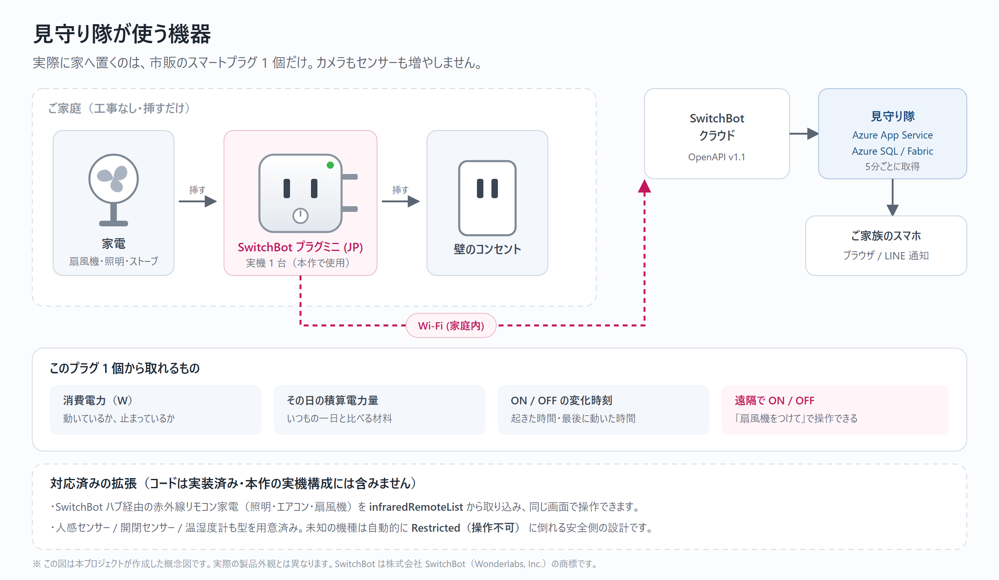

# 都知事杯オープンデータ・ハッカソン 提出内容

> **提出済み: 2026-08-20 01:09（JST）**。作品提出フォームを送信し、`Thank You! / あなたの入力フォームが受信されました。` を確認しました。提出内容の記録は [§11 提出実績](#11-提出実績) を参照してください。

提出フォームに入力する文面をここにまとめています。

## 0. 提出方法と日程

提出は**運営の作品提出フォーム（オンライン）1本**です。フォームのURLは Slack `#01_全体連絡` とメールで案内済みで、公式サイトには掲載されません。

| 期日 | やること |
|---|---|
| 8/17（月）23:59 | **参加確認フォーム**の回答（Slack `#01_全体連絡`／メール） |
| 8/22・8/23 | 集中開発 |
| **8/23（日）17:00** | **作品提出フォームの締切**（提出物すべて） |
| 8/26〜8/31 | First Stage 用の2分プレゼン動画を収録（オンラインZoom は8/26〜8/31・10:00〜20:30の30分枠／対面は8/29のみ。予約はフォーム⑥で行う） |
| 9月下旬 | First Stage 結果発表（24チームが Final Stage へ） |

フォームは7セクション。本書の見出しとの対応は次のとおりです。

| # | フォームの項目 | 本書 |
|---|---|---|
| ① | チーム情報（チーム名・人数・連絡担当・学生賞対象・役割・運用体制） | §1 |
| ② | 作品概要（課題の種類／作品名／詳細／着目した課題・背景／解決方法） | §2・§3 |
| ③ | 技術詳細（技術選定理由／生成AI活用／デモURL／ハードウェア有無） | §4・§5 |
| ④ | オープンデータの利用状況（**最大10件**） | §6・[OPENDATA.md](OPENDATA.md) |
| ⑤ | プレゼン資料（PPTX/PDF・**16:9**）＋画面キャプチャ**最大3点** | §7・§8 |
| ⑥ | First Stage 収録日の予約（方法・日時・言語） | — |
| ⑦ | 権利関係の確認と同意（生成AI利用の明記・ライセンス・個人情報） | §10 |

デモURLまたは操作デモ動画は任意（ハードウェア系のみ必須）。**本作品は市販のスマートプラグ1個を実際に使うため「ハードウェアあり」で申告し、操作デモ動画を必須扱いで提出します**（自作ハードウェアはありません）。判断に迷う項目は、提出しない側ではなく提出する側に倒しています。

**素材の注意**（運営指定）: 引用には出典明記。地図はロゴ・帰属表示を隠さない。デモ動画のBGMは使わない。音声合成は合理的理由がある場合のみ。東京都オープンデータカタログサイト掲載データとCCライセンス表示データは許諾不要、それ以外の都データは許諾が要るためダミーデータで進める。

---

## 1. チーム情報

<!-- 参加確認フォーム（8/17締切）で申告した内容と揃えること -->

- チーム名: 曽我部 雅明
- メンバー構成: 1名（曽我部 雅明 / 合同会社SmartDesigner）
- エントリー時メールアドレス: `msogabe@sdesigner.tokyo`
- 当日参加形態: 8/22・8/23 ともにオンライン参加

---

## 2. サービス概要

「見守り隊 / CareRoute AI」は、カメラを置かずに離れて暮らす高齢の家族を見守るサービスです。家電の消費電力という、本人が意識しないで残る記録だけを使い、起床・就寝・在宅の様子を推定します。そこに環境省の暑さ指数と気象庁の気温という屋外のオープンデータを重ね、「厳重警戒なのに冷房が止まっている」という室内熱中症の一点を、先回りして家族のLINEへ知らせます。見守られる本人にも見返りがあります。リモコンまで歩かずに「エアコンつけて」と話しかけるだけで操作でき、暑い日には画面に「冷房をつけますか」とボタンが出ます。ただし火や熱をあつかう家電は、AIがどう判断しても最終段のルールが止めます。

---

## 3. 着目した課題・背景、サービスの詳細

東京都のオープンデータによると、熱中症で救急搬送された人の56.6%は住居内で発生しています（令和3年・東京都福祉局）。65歳以上では中等症以上が半数を超え、搬送は10〜14時に集中します。ひとりで在宅している時間帯です。屋外の熱中症対策だけでは、半分以上を取りこぼしています。一方で、常時カメラによる見守りは本人が受け入れません。そこで家電の電力だけを見ることにしました。室内が危険かどうかは、屋外の暑さ指数と「冷房が実際に動いているか」を掛け合わせて初めて分かります。判定はすべて決定論的なルールで行い、生成AIには委ねていません。命に関わる判断を確率的な出力に任せないためです。冬は気象庁の気温へ軸を替え、通年で動き続けます。

---

## 4. プロダクト・技術詳細

.NET 10 の Blazor Web App を Azure App Service で運用しています。家電は SwitchBot の実機とモックを設定だけで切り替えられ、秘密情報がひとつも無い状態でも全機能が動きます。家電のイベントは Azure SQL に保存すると同時に Eventstream 経由で Microsoft Fabric の Eventhouse へ流し、KQL で時系列として分析します。Fabric 上には運用コンソールを別アプリとして置き、世帯・通知・電力・屋外気温を1画面で確認できます。オープンデータは定期取得し、失敗時は直前のキャッシュを返します。猛暑日にAPIが落ちた瞬間に見守りまで止まるのを避けるためです。家族への連絡は LINE Messaging API、本人との対話は LIFF でトーク内に3Dマスコットを表示します。自動テストは1,065件です。

判定ロジックは、検知率だけでなく**誤報率**も測っています。見守りの寿命を決めるのは「危ない日に鳴ること」より「何でもない日に黙っていること」だからです。平常日32件・異常日20件のラベル付きシナリオを毎回リプレイし、平常日の誤報0件・異常日の見逃し0件を CI のゲートにしています（`docs/eval/false-alarm-rate.md`）。判定は引数だけで完結する純関数で、生成AIも外部APIも使わないため、毎 push で再計算できます。この評価は最初の実行で自分のバグを1件見つけました。「活動量が普段より少ない」の判定が、進行中の一日の集計を終わった一日の平均と比べていたため、全世帯が毎朝鳴る状態でした。しかも鳴る引き金は、起きて照明を点けたことでした。

### 家に置く機器（市販のスマートプラグ 1 個だけ）

見守りのために新しくカメラやセンサーを設置しません。**家電量販店で買える SwitchBot のスマートプラグを、今ある家電のプラグとコンセントのあいだに挟むだけ**です。工事も配線も不要で、本人には「何かを設置された」という感覚がほとんど残りません。カメラが受け入れられない理由をそのまま回避しています。

| 項目 | 内容 |
| --- | --- |
| 実機 | **SwitchBot プラグミニ (JP) × 1 台**（アプリ上の名前 `プラグミニ 92`、OpenAPI の `deviceType` は `Plug`） |
| 設置 | 家電のプラグを抜いて挟むだけ。工事・配線・電池なし |
| 取得するデータ | 消費電力（`electricCurrent` × `voltage`）／その日の積算電力量（`weight`）／通電時間（`electricityOfDay`）／ON・OFF の変化時刻 |
| 操作 | `turnOn` / `turnOff`（「扇風機をつけて」で遠隔操作） |
| 取得方式 | SwitchBot OpenAPI v1.1 を既定5分間隔でポーリング（Webhook も併用、共有シークレットで認証） |
| 対応済みの拡張 | SwitchBot ハブ経由の赤外線リモコン家電（照明・エアコン・扇風機）を `infraredRemoteList` から取り込み。**本作の実機構成には含みません** |
| 安全側の既定 | マッピング表にない機種は `DeviceType.Unknown` → `DeviceSafetyPolicy` により自動的に `Restricted`（遠隔操作不可） |

プラグミニ (JP) はステータスに `power`（ON/OFF）フィールドを返さないため、電流が流れているかどうかから ON/OFF を推定しています。機種ごとにレスポンスの形が異なるので、公式仕様（[OpenWonderLabs/SwitchBotAPI](https://github.com/OpenWonderLabs/SwitchBotAPI)）の `devices/*.md` を機種ごとに確認して実装しました。詳細は `docs/SWITCHBOT_SETUP.md`。

> 上の図は本プロジェクトが作成した概念図です。実際の製品外観とは異なります。SwitchBot は株式会社 SwitchBot（Wonderlabs, Inc.）の商標であり、公式の製品写真は権利上の理由から掲載していません。

---

## 5. 技術選定の理由／生成AI等の活用方法／デモURL

生成AIは「言葉を解く」ところにだけ使い、「実行してよいか」の判断には使っていません。自然言語から意図と機器を取り出すのはLLM、実行の可否は決定論的なルールが決めます。火や熱をあつかう機器は周囲の安全確認をはさみ、遠隔ONを禁じた機器はAIがどう答えても動きません。操作は成功・失敗・拒否のすべてを監査記録します。モデルは Azure Model Router に自動選択させ、締切のある呼び出し（LINE応答の8秒）にだけ短いタイムアウト予算を設けています。選ばせない場所だけを決めるという方針です。同じ理由で、見守りの判定は Azure SQL の実測だけで完結させ、Microsoft Fabric は分析と可視化に限定しました。分析基盤が止まっても見守りは止まりません。

> **デモURL**: フォームに直接入力します（リポジトリ・資料には記載しません）
>
> **ハードウェアの有無**: **あり**。ただし自作の基板やセンサーはなく、家電量販店で買える **SwitchBot プラグミニ (JP) 1 台**を、今ある家電のプラグとコンセントのあいだに挟むだけです（詳細は §4 の表）。見守りのために新しくカメラやセンサーを設置しない、というのが本作の要点そのものなので、機器の少なさは仕様です。
>
> **操作デモ動画**: `docs/demo/mimamoritai-demo.mp4`（4分51秒・ナレーションと字幕あり・BGMなし）。本番環境を実際に操作して録画したもので、編集で切っていません。
> **提出用60秒版**: `docs/demo/mimamoritai-demo-60s.mp4`（59秒）。提出フォームの「60秒以内」に合わせ、上記のフル版から9場面を抜き出して字幕を焼き直したもの。運営指定の「音声を利用する作品以外は無音」に合わせて**音声トラックを持ちません**。

---

## 6. オープンデータの利用状況（10件）

詳細と取得URLは [OPENDATA.md](OPENDATA.md) にあります。

### 稼働中のシステムが実際に取得しているもの

| # | データ名 | 提供元 | 用途 |
|---|---|---|---|
| 1 | 暑さ指数（WBGT）予測値 | 環境省 熱中症予防情報サイト | 熱中症ガードの判定軸。冷房の稼働状況と突き合わせる |
| 2 | アメダス実況（気温・湿度） | 気象庁 | 通知文の裏付け。世帯ごとの最寄り観測所の切り替えにも使用 |
| 3 | 天気予報（東京 130000） | 気象庁 | 翌朝の最低気温からヒートショックを前夜に予告 |
| 4 | 気象警報・注意報（東京 130000） | 気象庁 | **特別警報のみ**を読む。通常の警報・注意報は通知しない |
| 5 | 防災情報XML「随時」フィード | 気象庁 | 土砂災害警戒情報と線状降水帯。上のJSONには含まれない別プロダクト |
| 6 | 地震情報一覧 | 気象庁 | **東京の震度5弱以上**のときだけ。震源の震度ではなく東京の観測値で判定 |

> 4〜6 は警報そのものを再送しません。緊急速報メールは全員に届くからです。伝えるのは2文目の「**お母さんのお宅では07:15に家電の利用がありました**」で、これはこのアプリしか持っていない情報です。家電の記録が無ければ「まだ確認できていません」と書き、沈黙を「無事」にも「異常」にも丸めません。

### 課題設定の根拠に用いたもの（すべて CC BY 4.0）

| # | データ名 | 提供元 | 分かったこと |
|---|---|---|---|
| 7 | 熱中症による救急搬送 発生場所別（令和3年） | 東京都福祉局 | 住居施設等 423人（**56.6%**）。屋外対策だけでは半分以上を取りこぼす |
| 8 | 65歳以上の初診時程度（令和3年） | 東京都福祉局 | 中等症48.9%／重症5.9%／重篤1.7%。半数以上が入院を要する |
| 9 | 熱中症搬送 時間帯別（令和3年） | 東京都福祉局 | 65歳以上は10〜14時に集中。日中ひとりで在宅する時間と重なる |
| 10 | 熱中症搬送人員の過去5年推移 | 東京消防庁 | 2019年6,094人 → 2023年**7,517人**。減っていない |

> フォームの上限が10件のため、ここには載せていないデータが3件あります（国勢調査 区市町村別世帯数／中野区・昭島市の地域包括支援センター一覧）。全件は [OPENDATA.md](OPENDATA.md) にあります。地域包括支援センターを**東京都全体で束ねた1本のデータが存在せず**、62区市町村のうち機械可読な形で公開しているのは3自治体のみのため、この2件は「今後つなぎ込む予定」に留めています。連絡先を推測で埋めることはしません。

---

## 7. 2分プレゼンの構成（120秒）

4分51秒のデモ動画（[DEMO_SCENARIO.md](DEMO_SCENARIO.md)）とは別物です。2分では**課題→データ→ガードレール**の3点に絞ります。

| 秒 | 内容 | 言うこと |
|---|---|---|
| 0:00–0:20 | 課題 | 熱中症の搬送、**住居内が56.6%**。屋外対策だけでは半分以上を取りこぼす。でもカメラは受け入れられない |
| 0:20–0:45 | 着眼 | 家電の電力だけを見る。ただし電力だけでは「暑いのに冷房が止まっている」は分からない。**屋外のオープンデータと掛け算**して初めて分かる |
| 0:45–1:15 | 実演 | 暑さ指数と電力を重ねたグラフ →「冷房をつけますか」→ ワンタップでON。本人が動かなくていい |
| 1:15–1:45 | ★ガードレール | 「ストーブつけて」→ AIは意図を解くが、**実行前にルールが周囲の安全確認を挟む**。命に関わる判断を確率的な生成に任せない |
| 1:45–2:00 | 続き方 | 暑さ指数は半年しか無い。冬は気温に軸を替えて同じ構造で動く。**通年で止まらない見守り** |

**削ってよい順**: マスコットの3D、Fabricの内部構成、認証まわり。**削ってはいけない**のは1:15–1:45です。

読み上げ用の台本と当日の段取りは [PITCH_2MIN.md](PITCH_2MIN.md) にあります。

この配分に対応した**2分版のスライド（6枚）**を `docs/mimamoritai-deck-2min.pptx` / `.pdf` に用意しています（本編18枚から 1・3・4・5・7・18 を抜き出し、ページ番号を1〜6へ振り直したもの）。

| 枚 | 内容 | 対応する秒 |
|---|---|---|
| 1 | タイトル | 0:00–0:10 |
| 2 | 課題（見守る側と見守られる側） | 0:10–0:30 |
| 3 | データ（住居内56.6% × オープンデータ） | 0:30–0:55 |
| 4 | 実演（電源の履歴だけで分かること） | 0:55–1:15 |
| 5 | ★ガードレール（AIに危険な判断をさせない） | 1:15–1:45 |
| 6 | 締め（1,065テスト／APIキー0本） | 1:45–2:00 |

---

## 8. 画面キャプチャ（最大3点）

| # | 画面 | 選定理由 |
|---|---|---|
| 1 | トップの見守りカード＋**冷房をつけますか**の提案 | 課題と解決が1枚に収まる唯一の画面 |
| 2 | **電力（棒）と気温（折れ線）を重ねた2軸グラフ** | オープンデータを使っていることが説明なしで伝わる |
| 3 | **ハザード確認のダイアログ**（ストーブ） | 「AIに任せていない」ことの唯一の可視的証拠 |

キャプチャ時の注意は §10 と同じです。

取得済みのファイル：

| # | ファイル | 撮影方法 |
|---|---|---|
| 1 | `docs/captures/01-cooling-suggestion.png` | 東京23区（44132）の実データで暑さ指数26＝警戒のとき撮影。冷房提案は**警戒（25以上）＋冷房機器が登録済みで停止中**が条件。夜間など東京が25未満のときは、同じ東京都のWBGT予測CSVに含まれる**小笠原（父島・地点コード44301）**を `OpenData__PointCode` で指定すれば、東京都のオープンデータのまま警戒帯を再現できる |
| 2 | `docs/captures/02-power-temperature-chart.png` | トップの「電気の使用量と外の気温」を要素キャプチャ |
| 3 | `docs/captures/03-hazard-confirm-dialog.png` | 電気ストーブの「つける」で出るハザード確認。**ブラウザ標準の confirm なので Playwright では撮れない**。Edge をアプリモード（`--app=` ＋専用 `--user-data-dir`）で開き、OSのウィンドウキャプチャで撮ること |

---

## 9. 提出物の所在

| 提出物 | 状態 | 場所（リポジトリ相対） |
|---|---|---|
| プレゼン資料 | 更新済み（**18枚**・16:9・8/20時点。10枚目に「『鳴らさなかった日』を数えている」を追加／テスト件数1,065。8/20にデモ動画の尺の誤記「5分51秒」を **4分51秒** へ訂正し、最終ページのデモ動画リンクを公開済みの YouTube URL に差し替え） | `docs/mimamoritai-deck.pptx` / `docs/mimamoritai-deck.pdf` |
| プレゼン資料（2分版） | 新規（**6枚**。§7の配分に対応して本編から 1・3・4・5・7・18 を抜き出し、ページ番号を1〜6へ振り直したもの。First Stage 収録用。**フォーム 5-1 に提出しているのはこちら**） | `docs/mimamoritai-deck-2min.pptx` / `docs/mimamoritai-deck-2min.pdf` |
| デモ動画（4分51秒） | 収録済み。冒頭にできること三つの宣言と Microsoft Fabric の運用コンソール、終盤にふつうの言葉での家電操作を加えて再収録（8/18）。ナレーション・字幕あり・BGMなし | `docs/demo/mimamoritai-demo.mp4` |
| 提出用デモ動画（59秒） | フル版から9場面を抜き出し字幕を焼き直し。フォーム規定の60秒以内・音声なし | `docs/demo/mimamoritai-demo-60s.mp4` |
| 〃 参考：音声操作と安全確認の回 | 収録済み（旧収録・本編に無い挙動の記録） | `docs/demo/mimamoritai-demo-voice-safety.mp4` |
| 2分プレゼン動画 | **未収録**（2026-08-27（木）19:00 JST に収録） | — |
| 画面キャプチャ3点 | 取得済み（8/16時点） | `docs/captures/` |
| 開発記録 | 公開済み | `docs/ARTICLE.md`（Qiita 版は `docs/qiita-body.md`） |
| 使う機器の構成図 | 追加（自作の概念図・公式製品写真は不使用） | `docs/images/hardware.svg` / `docs/images/hardware.png` |
| 誤報率の評価 | あり（平常日32件・異常日20件のラベル付きリプレイ。毎 push で CI が再計算） | `docs/eval/false-alarm-rate.md` |
| 稼働証跡 | あり | `docs/EVIDENCE.md` |
| アーキテクチャ | あり | `docs/ARCHITECTURE.md` |
| セキュリティ申告 | あり | `docs/SECURITY.md` |
| 公開リポジトリ | 公開中 | https://github.com/monoqlo78/mimamoritai-tokyo-opendata |

ローカルの絶対パスは、上記の相対パスに `C:\Users\msoga\OneDrive - Smart Designer\Projects\見守り隊\` を前置したものです。

> PDF を再出力するときは、`docs/` が OneDrive 同期配下のため PowerPoint がクラウド側の旧版を開くことがある。
> `C:\Temp` などローカルへ pptx をコピーしてから変換し、出力した PDF を `docs/` へ戻すこと。
>
> `scripts/build-deck.js` の出力は 13 枚。提出版はそこに showcase 3 枚と機器スライド 1 枚（`scripts/add-hardware-slide.py`）、
> 誤報率スライド 1 枚（`scripts/add-falsealarm-slide.py`）を足した 18 枚なので、
> 再生成する場合は追加分を戻すこと（無条件に上書きすると 5 枚失われる）。
>
> 数字とリンクが古くなったときは `scripts/refresh-deck-facts.py` に置換規則を足して当てること。

---

## 10. 提出前チェック（毎回）

- [x] 資料は**16:9**（PowerPoint または PDF）← 18枚・1.7778 を確認済み（8/18 再確認）
- [x] 引用資料に**出典を明記**、地図のロゴ・帰属表示を隠していない
      ← 地図は一切使っていない（leaflet / mapbox / 地理院タイルいずれも不使用）。オープンデータの出典は画面上（`Home.razor` の「出典：環境省熱中症予防情報サイト／気象庁」など）と動画の 2:19 の場面で明示している
- [x] デモ動画に**BGMを入れていない**（背後の生活音にも注意）
      ← 音声トラックは Azure AI Speech で合成したナレーションのみ。`mux.ps1` が wav を重ねる以外の音源を持たない
- [x] 資料・キャプチャ・動画に**デモサイトの実URLが映っていない**（URLはフォームにのみ入力）
      ← 資料(pptx)とリポジトリ追跡ファイルは文字列走査で確認済み。動画は headless Chromium（アドレスバーなし）で `localhost` を収録しており、URL が出うる唯一の箇所である「接続状況」も 3:31 のフレームで確認して実URLなし。キャプチャ3点も目視確認（03 に映るのは `localhost:5234`）
- [x] **個人のLINEアカウント**（表示名・アイコン・userId）が映っていない
      ← 動画・キャプチャとも「家族との共有」は折りたたんだまま。QR / ID / 表示名はどのフレームにも出ていない
- [x] **テナント名・管理者アカウント**が映っていない
      ← 資料(pptx)とリポジトリ追跡ファイルは `onmicrosoft.com` 不検出。運用コンソールの場面（0:15〜0:48）に出るアカウントは収録モードの固定ダミー `admin@contoso-demo.example`（`CaptureAuthService`）で、実テナントは映っていない
- [x] シークレットの値が映っていない（画面・ログ・設定画面）
      ← 開発者向けパネルは接続状況とデモ操作のみでキー類を表示しない。CI の secret-scan も通過
- [x] ブラウザはアプリモード＋専用プロファイル（タブ・ブックマークが映らない）
      ← 本編は Playwright の headless で収録しているため、そもそもブラウザUIが映らない
- [x] 通知アプリを終了（ポップアップの映り込み防止）
      ← 同上（headless のためデスクトップは映らない）
- [x] 収録前に家電を全台「停止中」に戻す
      ← 3:13 の場面で5台すべて「停止中」を確認

---

## 11. 提出実績

**2026-08-20 01:09（JST）に作品提出フォームを送信し、`Thank You! / あなたの入力フォームが受信されました。` を確認しました。**（送信先 `https://submit.jotform.com/261870604352051`）

**2026-08-20 12:28（JST）に編集リンク（`https://www.jotform.com/edit/6629648724772429423`）から 6-2 の収録枠のみを 8/26（水）19:00 → **8/27（木）19:00** へ変更して再送信しました。**再送信後に編集リンクを開き直し、`Selected Time: 19:00 木曜日, 8月 27, 2026` とエラー0件、添付4件と同意3点が維持されていることを確認しています。オンライン収録の受付期間は 8/26〜8/31 で、この期間に火曜日は含まれないため木曜日を選びました。

**2026-08-20 12:52（JST）に編集リンクから 5-1（プレゼン資料）を差し替えて再送信しました。** 変更点は次の3点です。

- **5-1 を 2分版の6枚デッキに差し替え** — フォーム 5-1 のサブラベルに「First Stage で利用する **2分間プレゼン用**のスライド。最大100MB・比率は16:9」と明記されていたため、18枚の詳細版はこの欄の用途に合わないと判断しました。2分の秒配分（§7）に合わせて6枚に再構成した `mimamoritai-deck-2min.pdf` のみを 5-1 に置き、18枚の詳細版は 3-5 のリポジトリ内 `docs/mimamoritai-deck.pdf` から参照できる旨を備考に1文追記しています。
- **デッキ内のデモ動画の尺の誤記を訂正** — 2箇所にあった「5分51秒」を実測値の **「4分51秒」** に修正しました（`docs/demo/mimamoritai-demo.mp4` の実尺は 291秒）。
- **最終スライドのデモ動画リンクを公開URLに変更** — リポジトリ内の相対パス表記から、公開済みの `https://youtu.be/IAOZOxOIT3Y` に置き換えました。

再送信後に編集リンクを開き直し、5-1 が `mimamoritai-deck-2min.pdf` の1件のみ、5-2 のキャプチャ3件、6-2 の収録枠 `2026-08-27 19:00`、3-3 / 3-8 の各URL、同意3点がいずれも維持されていることを確認しています。

送信した内容は次のとおりです。

| フォーム項目 | 送信した値 |
|---|---|
| 1-1 チーム名 | 曽我部 雅明 |
| 1-3 人数 | 1 |
| 1-6 連絡先メール | msogabe@sdesigner.tokyo |
| 1-7 学生賞 | いいえ |
| 2-1 課題の種類 | 自由課題 |
| 2-2 作品名 | 見守り隊 / CareRoute AI |
| 3-3 デモURL | https://app-mimamoritai-hack.azurewebsites.net/ |
| 3-5 その他URL | https://github.com/monoqlo78/mimamoritai-tokyo-opendata |
| 3-6 デモURLの一般公開 | はい |
| 3-7 ハードウェア | あり（市販のスマートプラグ SwitchBot プラグミニ1台） |
| 3-8 デモ操作動画 | https://youtu.be/IAOZOxOIT3Y （59秒・字幕あり・音声なし） |
| 4-1 利用オープンデータ | 10件（[OPENDATA.md](OPENDATA.md)） |
| 5-1 プレゼン資料 | mimamoritai-deck-2min.pdf（2分版6枚。8/20 12:52 に mimamoritai-deck.pdf から差し替え） |
| 5-2 画面キャプチャ | 3点（`docs/captures/`） |
| 6-1 収録方法 | オンライン（Zoom） |
| **6-2 First Stage 収録予約** | **2026-08-27（木）19:00 JST / 30分枠** |
| 6-3 収録時の言語 | 日本語 |
| 7 同意事項 | 3点すべて同意（ライセンス／募集要項11.留意事項／個人情報の取り扱い） |

2-3〜3-2 の各自由記述欄はフォーム側に **310文字の上限**があるため、本書 §2〜§5 の全文を310字以内に圧縮したものを送信しています（本書の原文が正、フォームは要約）。

### 提出後にやること

- **8/27（木）19:00 の収録**に向けて2分間のプレゼンを用意する。読み上げ台本・当日の段取り・映り込みチェックは [PITCH_2MIN.md](PITCH_2MIN.md) にまとめた（実測112〜122秒）。使うスライドは6枚版（`docs/mimamoritai-deck-2min.pdf`）
- **Zoom のリンクはフォームにも提出完了メールにも記載がない。**収録日が近づくと運営事務局から `msogabe@sdesigner.tokyo` または Slack `#01_全体連絡` に案内が届く。8/26（水）になっても届かない場合は事務局（`9_opendata-hackathon.tokyo@mizuho-rt.co.jp`）へ問い合わせる
- **収録映像は First Stage のアーカイブとして YouTube で一般公開される**。画面共有は6枚版PDFの全画面のみとし、テナント名・LINEアカウント・デモサイトの実URLを映さない
- デモサイト `https://app-mimamoritai-hack.azurewebsites.net/` は審査期間中は停止しない
- YouTubeの60秒動画（`https://youtu.be/IAOZOxOIT3Y`）は公開のまま維持する
